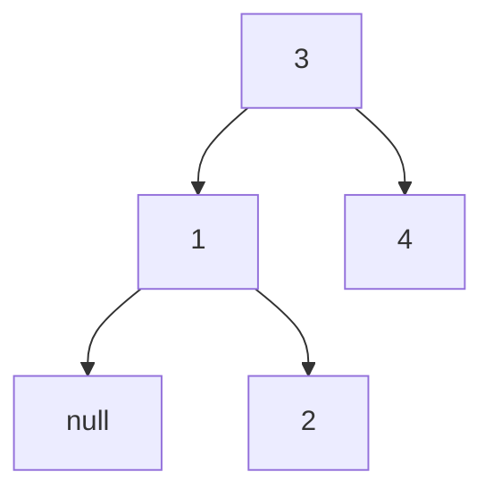

# 57. Kth Smallest Element in a BST

## Problem

Given the root of a binary search tree (BST) and an integer k, find and return the kth smallest value stored in the tree (where k is 1-indexed, so k=1 means the smallest value).

## Example 1

### Input

```text
root = [3,1,4,null,2], k = 1
```

### Expected Output

```text
1
```

### Explanation

The sorted order of values is [1, 2, 3, 4], and the 1st smallest is 1.

## Example 2

### Input

```text
root = [5,3,6,2,4,null,null,1], k = 3
```

### Expected Output

```text
3
```

### Explanation

The sorted order of values is [1, 2, 3, 4, 5, 6], and the 3rd smallest is 3.

## How to Solve

### Key Idea

An in-order traversal (left, node, right) of a BST visits nodes in ascending sorted order, so the kth value visited during that traversal is the answer.

### Approach

1. Do an iterative in-order traversal using a stack: keep pushing left children until you hit null.
2. Pop a node from the stack, decrement a counter k, and if k reaches 0, that node's value is the answer.
3. If not, move to the popped node's right child and repeat the process of pushing left children.

### Why It Works

In-order traversal of a BST always produces values in increasing order because it visits everything smaller (the left subtree) before the node itself, and everything larger (the right subtree) after. Stopping at the kth visited node gives exactly the kth smallest value.

## Visual Explanation



In-order traversal visits 1 -> 2 -> 3 -> 4, so for k=1 the answer is 1.

## Optimal Solution

```python
class Solution:
    def kthSmallest(self, root: TreeNode, k: int) -> int:
        stack = []
        node = root

        while stack or node:
            while node:
                stack.append(node)
                node = node.left

            node = stack.pop()
            k -= 1

            if k == 0:
                return node.val

            node = node.right

        return -1
```

## Complexity

- **Time:** O(h + k) — we descend to the leftmost node (O(h)) and then visit k nodes in order.
- **Space:** O(h) — the stack holds at most one path's worth of nodes.

## Real-World Uses

- Finding the Nth-ranked record in a sorted database index without a full sort.
- Computing percentile/rank queries over an ordered index structure.
- Implementing "top-N" leaderboard lookups backed by a balanced search tree.

## Key Takeaway

In-order traversal is the go-to tool whenever you need BST values in sorted order, and doing it iteratively lets you stop early once you find what you need.
