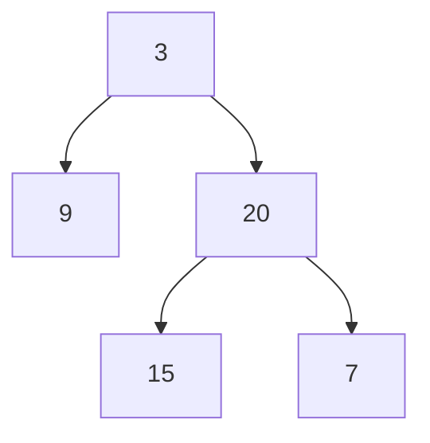

# 58. Construct Binary Tree From Preorder and Inorder Traversal

## Problem

Given two integer arrays, preorder and inorder, representing the preorder and inorder traversal of the same binary tree (with unique values), reconstruct and return the original binary tree.

## Example 1

### Input

```text
preorder = [3,9,20,15,7], inorder = [9,3,15,20,7]
```

### Expected Output

```text
[3,9,20,null,null,15,7]
```

### Explanation

The first value in preorder (3) is the root; everything before 3 in inorder (9) is the left subtree, and everything after (15,20,7) is the right subtree.

## Example 2

### Input

```text
preorder = [-1], inorder = [-1]
```

### Expected Output

```text
[-1]
```

### Explanation

A single node tree: the root is -1 with no children.

## How to Solve

### Key Idea

The first element of preorder is always the root. Find that value's position in inorder — everything to its left is the left subtree's inorder sequence, and everything to its right is the right subtree's.

### Approach

1. Build a hash map from value to index in inorder for O(1) lookups.
2. Keep a pointer into preorder (starting at 0). Recursively build the tree given a range [left, right] of the current subtree's inorder bounds.
3. Take the next value from preorder as the root, look up its index in inorder to split the range, then recursively build the left subtree (using the left part of the range) before the right subtree (using the right part), since preorder visits left before right.

### Why It Works

Preorder always lists a subtree's root before its children, so consuming values from preorder in order while using inorder to know how many nodes belong to the left subtree correctly reconstructs the exact tree shape.

## Visual Explanation



preorder=[3,9,20,15,7] gives root 3 first; inorder=[9,3,15,20,7] shows 9 as the whole left subtree and [15,20,7] as the right.

## Optimal Solution

```python
class Solution:
    def buildTree(self, preorder: list[int], inorder: list[int]) -> TreeNode:
        inorder_index = {val: i for i, val in enumerate(inorder)}
        self.pre_idx = 0

        def build(left, right):
            if left > right:
                return None

            root_val = preorder[self.pre_idx]
            self.pre_idx += 1
            root = TreeNode(root_val)

            mid = inorder_index[root_val]

            root.left = build(left, mid - 1)
            root.right = build(mid + 1, right)

            return root

        return build(0, len(inorder) - 1)
```

## Complexity

- **Time:** O(n) — each node is created once, and index lookups are O(1) via the hash map.
- **Space:** O(n) — for the hash map and recursion stack.

## Real-World Uses

- Rebuilding an expression tree from serialized traversal logs for a compiler or interpreter.
- Reconstructing a UI component tree from separate ordering metadata streams.
- Restoring a document outline structure from two independently stored traversal orders.

## Key Takeaway

Preorder tells you "what comes first" (the root), and inorder tells you "how to split" (left vs right sizes) — combining both traversals lets you rebuild a tree uniquely.
