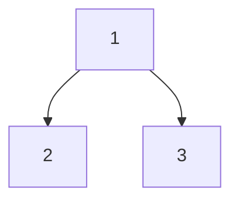

# 59. Binary Tree Maximum Path Sum

## Problem

Given the root of a binary tree, find the maximum possible sum of node values along any path in the tree. A path is any sequence of nodes connected by edges, where each node appears at most once, and it does not need to pass through the root.

## Example 1

### Input

```text
root = [1,2,3]
```

### Expected Output

```text
6
```

### Explanation

The best path is 2 -> 1 -> 3, with sum 2 + 1 + 3 = 6.

## Example 2

### Input

```text
root = [-10,9,20,null,null,15,7]
```

### Expected Output

```text
42
```

### Explanation

The best path is 15 -> 20 -> 7, with sum 15 + 20 + 7 = 42, ignoring the negative root.

## How to Solve

### Key Idea

For each node, compute the best "downward" path sum starting at that node (usable by its parent), while separately tracking the best "through this node" path sum (left branch + node + right branch), which may not extend further up.

### Approach

1. Write a recursive helper that returns the maximum sum of a path that starts at the given node and goes down into at most one child (a "one-sided" path), since a parent can only continue the path through one child.
2. At each node, get the best one-sided contributions from the left and right children, clamping any negative contribution to 0 (skip that branch instead of hurting the sum).
3. Update a global maximum using node.val + left_contribution + right_contribution (the best path passing through this node using both children), then return node.val + max(left_contribution, right_contribution) as this node's one-sided contribution to its parent.

### Why It Works

Any path in a tree has a single highest point where it stops going up. At that point, the path can use contributions from both children, but for any node further up to reuse this node's result, it can only continue through one side, since a straight path can't branch in two directions from the middle.

## Visual Explanation



Leaves 2 and 3 each contribute a one-sided gain of 2 and 3 (clamped at 0 if negative). At the root, the through-node sum is 1 + 2 + 3 = 6, which becomes the max, since a path can use both children only at the node where it turns.

## Optimal Solution

```python
class Solution:
    def maxPathSum(self, root: TreeNode) -> int:
        self.max_sum = float('-inf')

        def max_gain(node):
            if not node:
                return 0

            left_gain = max(max_gain(node.left), 0)
            right_gain = max(max_gain(node.right), 0)

            self.max_sum = max(self.max_sum, node.val + left_gain + right_gain)

            return node.val + max(left_gain, right_gain)

        max_gain(root)
        return self.max_sum
```

## Complexity

- **Time:** O(n) — every node is visited once.
- **Space:** O(h) — recursion stack, where h is the tree height.

## Real-World Uses

- Finding the highest-value route through a hierarchical network of weighted connections.
- Computing the most profitable chain of decisions in a decision-tree model.
- Identifying the strongest chain of dependencies in a project or skill tree with weighted nodes.

## Key Takeaway

Separate "the best answer overall" from "what can be passed up to the parent" — this pattern of tracking two different values at once shows up often in tree DP problems.
