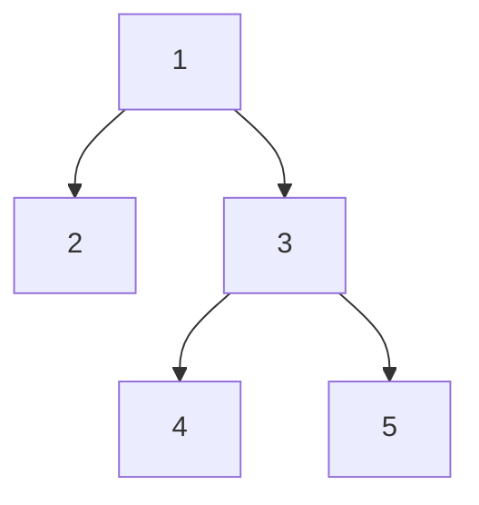

# 60. Serialize and Deserialize Binary Tree

## Problem

Design an algorithm to serialize a binary tree into a single string, and deserialize that string back into a binary tree with the exact same structure and values. The tree may contain any integer values, including duplicates.

## Example 1

### Input

```text
root = [1,2,3,null,null,4,5]
```

### Expected Output

```text
[1,2,3,null,null,4,5]
```

### Explanation

Serializing the tree and then deserializing the result produces a tree identical to the original.

## Example 2

### Input

```text
root = []
```

### Expected Output

```text
[]
```

### Explanation

An empty tree serializes to a representation of "empty" and deserializes back into an empty tree (null root).

## How to Solve

### Key Idea

Use preorder traversal (node, then left, then right) to turn the tree into a string, explicitly marking null children with a placeholder like "N" so the structure can be rebuilt without ambiguity.

### Approach

1. To serialize, do a preorder DFS: append the current node's value to a list, or append a marker like "N" if the node is null, then recurse into left and right. Join the list into a single string.
2. To deserialize, split the string back into a list of tokens and use an iterator/index pointer over it.
3. Recursively rebuild the tree: read the next token, if it's the null marker return None, otherwise create a node with that value and recursively set its left and right children by consuming the next tokens in the same order they were written.

### Why It Works

Preorder traversal with explicit null markers records enough information to know exactly where each subtree starts and ends, since the same recursive left-then-right order used to write the string is used to read it back, so there's no ambiguity in reconstructing the tree.

## Visual Explanation



Preorder DFS with null markers writes: 1,2,N,N,3,4,N,N,5,N,N — enough to rebuild the exact shape.

## Optimal Solution

```python
class Codec:
    def serialize(self, root: TreeNode) -> str:
        values = []

        def dfs(node):
            if not node:
                values.append('N')
                return

            values.append(str(node.val))
            dfs(node.left)
            dfs(node.right)

        dfs(root)
        return ','.join(values)

    def deserialize(self, data: str) -> TreeNode:
        values = iter(data.split(','))

        def build():
            val = next(values)
            if val == 'N':
                return None

            node = TreeNode(int(val))
            node.left = build()
            node.right = build()
            return node

        return build()
```

## Complexity

- **Time:** O(n) — each node is written once during serialize and read once during deserialize.
- **Space:** O(n) — for the string representation and recursion stack.

## Real-World Uses

- Saving and loading a scene graph or UI component tree to/from disk or a network payload.
- Persisting an in-memory parse tree (AST) to JSON for caching or transmission between services.
- Storing and restoring hierarchical documents (e.g. nested comments, folder trees) in a database.

## Key Takeaway

Recording null markers during a preorder traversal is a simple and reliable way to encode tree shape, since the same traversal order can be replayed to rebuild the tree exactly.
