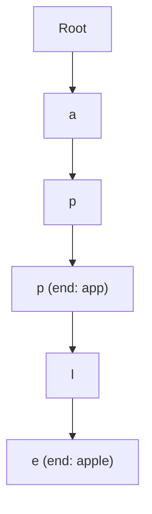

# 61. Implement Trie

## Problem

A Trie (prefix tree) is a tree-like structure that stores words letter by letter, so words that share a prefix share the same path in the tree. You need to build a Trie that supports three operations: `insert(word)` to add a word, `search(word)` to check if an exact word exists, and `startsWith(prefix)` to check if any word starts with a given prefix.

## Example 1

### Input

```text
insert("apple")
search("apple")
search("app")
startsWith("app")
insert("app")
search("app")
```

### Expected Output

```text
None
True
False
True
None
True
```

### Explanation

After inserting "apple", searching "app" fails since "app" was never inserted as a complete word, but startsWith("app") is true since "apple" starts with "app". After inserting "app" too, search("app") becomes true.

## Example 2

### Input

```text
insert("cat")
search("dog")
startsWith("ca")
```

### Expected Output

```text
None
False
True
```

### Explanation

"dog" was never inserted so search returns false. "ca" is a valid prefix of "cat" so startsWith returns true.

## How to Solve

### Key Idea

Each node in the Trie represents one letter, and it holds links to its children letters, plus a flag saying "a word ends here."

### Approach

1. Create a TrieNode class with a dictionary of children and a boolean `is_end` flag.
2. To insert a word, walk through each character, creating a new child node if it doesn't exist, and mark `is_end` true at the last character.
3. To search a full word, walk through each character following children; if any character is missing, return false, otherwise check `is_end` at the last node.
4. To check a prefix, do the same walk but don't check `is_end` — just confirm the whole prefix path exists.

### Why It Works

Because every word is broken into a chain of single-character nodes, common prefixes are automatically shared. Checking presence is just following links, which takes time proportional to the word length, not the number of words stored.

## Visual Explanation



## Optimal Solution

```python
class TrieNode:
    def __init__(self):
        self.children = {}
        self.is_end = False


class Trie:
    def __init__(self):
        self.root = TrieNode()

    def insert(self, word: str) -> None:
        node = self.root
        for ch in word:
            if ch not in node.children:
                node.children[ch] = TrieNode()
            node = node.children[ch]
        node.is_end = True

    def search(self, word: str) -> bool:
        node = self._find_node(word)
        return node is not None and node.is_end

    def startsWith(self, prefix: str) -> bool:
        return self._find_node(prefix) is not None

    def _find_node(self, word: str):
        node = self.root
        for ch in word:
            if ch not in node.children:
                return None
            node = node.children[ch]
        return node
```

## Complexity

- **Time:** O(L) for insert, search, and startsWith, where L is the length of the word/prefix
- **Space:** O(N) total across all inserted words, where N is the total number of characters stored

## Real-World Uses

- Autocomplete and search-bar suggestions that expand as you type a prefix.
- Spell checkers and dictionary lookups for validating words quickly.
- IP routing tables that match the longest matching prefix of an address.

## Key Takeaway

A Trie trades some memory for very fast prefix and word lookups by sharing common prefixes as a tree path. This is the foundation for autocomplete, spell-check, and many string-matching problems.
