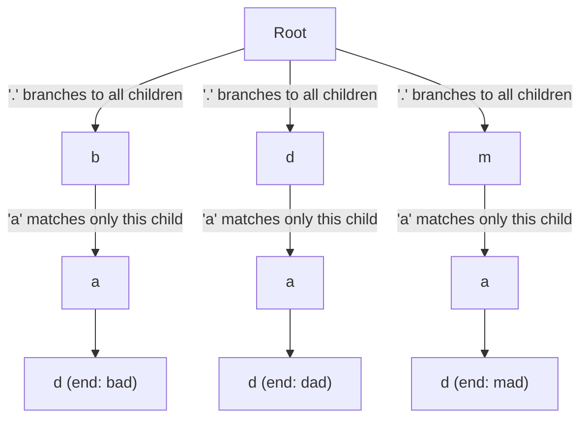

# 62. Design Add and Search Words Data Structure

## Problem

Design a data structure that supports adding words and searching for them, where a search word may contain the special character `.` which can match any single letter. This is like a Trie, but the search step needs to handle wildcards.

## Example 1

### Input

```text
addWord("bad")
addWord("dad")
addWord("mad")
search("pad")
search("bad")
search(".ad")
search("b..")
```

### Expected Output

```text
None
None
None
False
True
True
True
```

### Explanation

"pad" was never added so it's false. "bad" matches exactly. ".ad" matches "bad", "dad", or "mad" since `.` can be any letter. "b.." matches "bad" since the two dots can be any letters.

## Example 2

### Input

```text
addWord("a")
search("a")
search(".")
search("aa")
```

### Expected Output

```text
None
True
True
False
```

### Explanation

"a" matches itself, "." also matches the single letter "a", but "aa" is length 2 and no word of that length was added.

## How to Solve

### Key Idea

Use the same Trie structure as before, but when searching and you hit a `.`, try every possible child branch instead of just one.

### Approach

1. Build a TrieNode with children and an `is_end` flag, same as a standard Trie.
2. `addWord` works exactly like Trie insert: walk/create nodes character by character.
3. `search` uses a recursive helper that takes the current node and the remaining part of the word.
4. If the current character is a normal letter, move to that specific child if it exists, otherwise fail.
5. If the current character is `.`, try recursing into every child node; if any path succeeds, return true.
6. When the remaining word is empty, return whether the current node's `is_end` is true.

### Why It Works

The `.` wildcard just means "branch out and check all possibilities at this position." Because we only branch at dots, and most words have few or no dots, this stays efficient in practice while still being correct for every combination.

## Visual Explanation



Tracing `search(".ad")`: at position 0 the `.` forces the DFS to try all three children of Root (`b`, `d`, `m`) instead of following one path. Each branch then matches the literal `a`, then the literal `d`, landing on an `is_end` node — so all three explored paths succeed and the search returns `True` as soon as the first one does. Contrast with `search("bad")`, which follows a single fixed path (`b`→`a`→`d`) with no branching at all.

## Optimal Solution

```python
class TrieNode:
    def __init__(self):
        self.children = {}
        self.is_end = False


class WordDictionary:
    def __init__(self):
        self.root = TrieNode()

    def addWord(self, word: str) -> None:
        node = self.root
        for ch in word:
            if ch not in node.children:
                node.children[ch] = TrieNode()
            node = node.children[ch]
        node.is_end = True

    def search(self, word: str) -> bool:
        def dfs(node: TrieNode, i: int) -> bool:
            if i == len(word):
                return node.is_end
            ch = word[i]
            if ch == '.':
                for child in node.children.values():
                    if dfs(child, i + 1):
                        return True
                return False
            else:
                if ch not in node.children:
                    return False
                return dfs(node.children[ch], i + 1)

        return dfs(self.root, 0)
```

## Complexity

- **Time:** O(L) for addWord; O(26^D * L) worst case for search, where L is word length and D is the number of dots (in practice much faster since real inputs rarely hit the worst case)
- **Space:** O(N) total across all inserted words, plus O(L) recursion stack per search

## Real-World Uses

- Fuzzy search boxes that let users search with unknown or masked characters.
- Crossword or word-puzzle solvers matching partially known letter patterns.
- Log or config pattern matching where certain positions are wildcards.

## Key Takeaway

Wildcards in Trie search are handled by branching into all children at that position instead of following one fixed path. This pattern of "Trie + backtracking/DFS" shows up in many prefix-matching problems.
