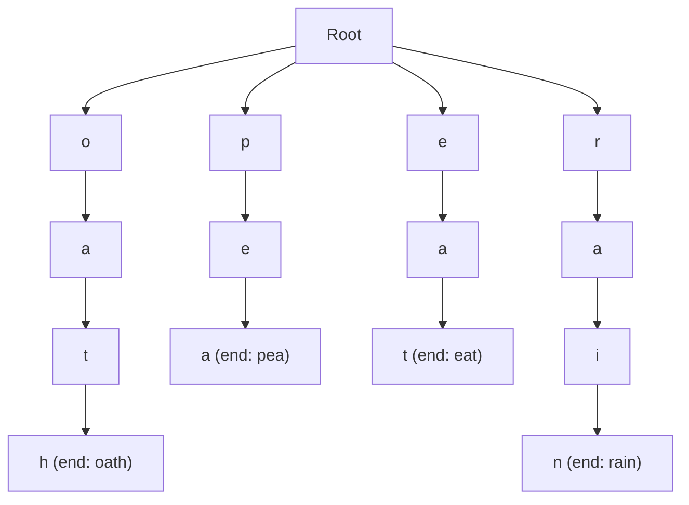

# 63. Word Search II

## Problem

You are given a 2D board of letters and a list of words. Find all the words from the list that can be formed by moving between adjacent cells (up, down, left, right), without reusing the same cell twice in one word. Return the words that can be found on the board.

## Example 1

### Input

```text
board = [
  ["o","a","a","n"],
  ["e","t","a","e"],
  ["i","h","k","r"],
  ["i","f","l","v"]
]
words = ["oath","pea","eat","rain"]
```

### Expected Output

```text
["eat","oath"]
```

### Explanation

"oath" can be traced starting from the top-left "o" going down and right. "eat" can be traced through the middle letters. "pea" and "rain" cannot be formed by any path of adjacent cells.

## Example 2

### Input

```text
board = [
  ["a","b"],
  ["c","d"]
]
words = ["abcb"]
```

### Expected Output

```text
[]
```

### Explanation

"abcb" would need to reuse the letter "b" twice, but each board cell can only be used once per word, so it cannot be formed.

## How to Solve

### Key Idea

Instead of searching the board separately for every word (slow), build one Trie from all the words, then do a single DFS walk over the board that follows the Trie as it goes, checking many words at once.

### Approach

1. Insert all words into a Trie, and store the complete word string at the ending node (so we can report it instantly when found).
2. For every starting cell on the board, run a DFS that only continues if the current letter matches a child in the current Trie node.
3. Mark the cell as visited (e.g. temporarily change it to a placeholder) before recursing into neighbors, and restore it afterward (backtracking).
4. Whenever a Trie node has `word` set (a full match), add it to the results and clear that field so it isn't added twice.
5. Optionally prune: after fully exploring a Trie node's subtree with no more words left in it, remove that branch to speed up future searches.

### Why It Works

Because all words share the Trie, a single DFS pass over the board simultaneously checks every word that shares a prefix, avoiding repeated work. Backtracking (undo-the-visit-mark) ensures each DFS path only uses each cell once, matching the problem's rule.

## Visual Explanation



All four words (`oath`, `pea`, `eat`, `rain`) are inserted into the Trie first. The board DFS then walks this Trie one shared structure at a time: it reaches `oath` and `eat` (both get reported and cleared), but the `pea` and `rain` branches are never matched by any path of adjacent board cells, so those two words never make it into the result.

## Optimal Solution

```python
from typing import List


class TrieNode:
    def __init__(self):
        self.children = {}
        self.word = None  # stores full word when this node completes one


class Solution:
    def findWords(self, board: List[List[str]], words: List[str]) -> List[str]:
        root = TrieNode()
        for w in words:
            node = root
            for ch in w:
                if ch not in node.children:
                    node.children[ch] = TrieNode()
                node = node.children[ch]
            node.word = w

        rows, cols = len(board), len(board[0])
        result = []

        def dfs(r: int, c: int, node: TrieNode) -> None:
            ch = board[r][c]
            if ch not in node.children:
                return
            next_node = node.children[ch]

            if next_node.word is not None:
                result.append(next_node.word)
                next_node.word = None  # avoid duplicate results

            board[r][c] = "#"  # mark visited
            for dr, dc in ((1, 0), (-1, 0), (0, 1), (0, -1)):
                nr, nc = r + dr, c + dc
                if 0 <= nr < rows and 0 <= nc < cols and board[nr][nc] != "#":
                    dfs(nr, nc, next_node)
            board[r][c] = ch  # restore

            # prune leaf nodes with no remaining words to speed up future searches
            if not next_node.children:
                del node.children[ch]

        for r in range(rows):
            for c in range(cols):
                dfs(r, c, root)

        return result
```

## Complexity

- **Time:** O(M * 4 * 3^(L-1)) for the DFS exploration, where M is the number of board cells and L is the max word length (plus O(sum of word lengths) to build the Trie)
- **Space:** O(sum of word lengths) for the Trie, plus O(L) recursion stack per DFS path

## Real-World Uses

- Word-search and Boggle-style game solvers that check many words at once.
- Multi-pattern text search engines matching a large word list against a document.
- DNA/sequence motif scanning where many known subsequences are searched simultaneously.

## Key Takeaway

When you need to search a grid for many words at once, combine them into a single Trie and do one DFS/backtracking pass — this shares work across words instead of repeating a full board search for each one.
