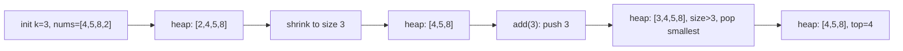

# 64. Kth Largest Element in a Stream

## Problem

Design a class that keeps track of the kth largest element in a stream of numbers. It is initialized with an integer `k` and an array of initial numbers. Every time a new number is added, the class should return the kth largest element among all numbers seen so far.

## Example 1

### Input

```text
KthLargest(3, [4, 5, 8, 2])
add(3)
add(5)
add(10)
add(9)
add(4)
```

### Expected Output

```text
4, 5, 5, 8, 8
```

### Explanation

After each `add`, we look at all numbers seen so far and return the 3rd largest one.

## Example 2

### Input

```text
KthLargest(1, [])
add(-3)
add(-2)
add(-4)
```

### Expected Output

```text
-3, -2, -2
```

### Explanation

With k = 1, we just return the largest number seen so far.

## How to Solve

### Key Idea

Keep a min-heap of size k. The smallest item in that heap is always the kth largest overall, because the heap only holds the k biggest numbers seen so far.

### Approach

1. Push all initial numbers into a min-heap, then shrink the heap down to size k (pop the smallest while size > k).
2. When `add(val)` is called, push `val` onto the heap.
3. If the heap size exceeds k, pop the smallest element.
4. Return the heap's smallest element (the top), which is the kth largest overall.

### Why It Works

A min-heap capped at size k always contains exactly the k largest numbers seen so far. The smallest of those k numbers is, by definition, the kth largest overall.

## Visual Explanation



## Optimal Solution

```python
import heapq

class KthLargest:
    def __init__(self, k: int, nums: list[int]):
        self.k = k
        self.heap = nums
        heapq.heapify(self.heap)
        while len(self.heap) > k:
            heapq.heappop(self.heap)

    def add(self, val: int) -> int:
        heapq.heappush(self.heap, val)
        if len(self.heap) > self.k:
            heapq.heappop(self.heap)
        return self.heap[0]
```

## Complexity

- **Time:** O(log k) per `add` call, O(n log k) for initialization
- **Space:** O(k) for the heap

## Real-World Uses

- Leaderboards that continuously show the kth-highest score as new scores come in.
- Real-time monitoring systems that flag when a metric enters the top-k most severe readings.
- Streaming analytics pipelines that track the kth-largest transaction or event without storing the full history.

## Key Takeaway

Whenever you need to track the "top k" of something continuously, a fixed-size min-heap of size k is the go-to pattern.
