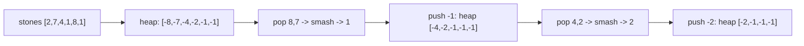

# 65. Last Stone Weight

## Problem

You are given an array of stones, where each value is a stone's weight. On each turn, pick the two heaviest stones and smash them together. If they have equal weight, both stones are destroyed. If not, the lighter stone is destroyed and the heavier one's weight becomes the difference between the two. Keep going until at most one stone remains, and return its weight (or 0 if none remain).

## Example 1

### Input

```text
stones = [2, 7, 4, 1, 8, 1]
```

### Expected Output

```text
1
```

### Explanation

Smash 8 and 7 -> 1. Stones: [2,4,1,1,1]. Smash 4 and 2 -> 2. Stones: [2,1,1,1]. Smash 2 and 1 -> 1. Stones: [1,1,1]. Smash 1 and 1 -> 0. Stones: [1]. Final weight is 1.

## Example 2

### Input

```text
stones = [1]
```

### Expected Output

```text
1
```

### Explanation

Only one stone exists, so no smashing happens and it is the final weight.

## How to Solve

### Key Idea

We repeatedly need the two largest values, which is exactly what a max-heap gives us quickly. Python's `heapq` is a min-heap, so we negate all values to simulate a max-heap.

### Approach

1. Negate every stone weight and push them all into a heap (making it act like a max-heap).
2. While more than one stone remains, pop the two largest (most negative values), compute the difference of their true weights.
3. If the difference is nonzero, push the negated difference back onto the heap.
4. When 0 or 1 stones remain, return the remaining weight (or 0 if empty).

### Why It Works

The heap always gives us the two currently heaviest stones in O(log n) time, so we never need to re-sort the whole list after each smash.

## Visual Explanation



## Optimal Solution

```python
import heapq

class Solution:
    def lastStoneWeight(self, stones: list[int]) -> int:
        heap = [-s for s in stones]
        heapq.heapify(heap)

        while len(heap) > 1:
            first = -heapq.heappop(heap)
            second = -heapq.heappop(heap)
            if first != second:
                heapq.heappush(heap, -(first - second))

        return -heap[0] if heap else 0
```

## Complexity

- **Time:** O(n log n)
- **Space:** O(n) for the heap

## Real-World Uses

- Simulation engines that repeatedly combine the two largest resources or forces in a system.
- Auction or bidding systems that repeatedly match the top two bids against each other.
- Tournament bracket simulations that repeatedly pit the two strongest remaining competitors together.

## Key Takeaway

When you keep needing the current maximum (or two maximums) after each update, a max-heap (simulated via negation in Python) beats re-sorting every time.
