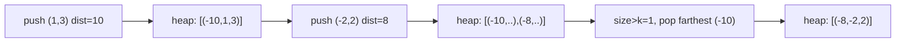

# 66. K Closest Points to Origin

## Problem

Given a list of points on a 2D plane and an integer `k`, return the `k` points that are closest to the origin `(0, 0)`. Distance is measured using standard Euclidean distance. The answer can be returned in any order.

## Example 1

### Input

```text
points = [[1,3],[-2,2]], k = 1
```

### Expected Output

```text
[[-2,2]]
```

### Explanation

Distance of (1,3) is sqrt(10) ≈ 3.16. Distance of (-2,2) is sqrt(8) ≈ 2.83. The closest 1 point is (-2,2).

## Example 2

### Input

```text
points = [[3,3],[5,-1],[-2,4]], k = 2
```

### Expected Output

```text
[[3,3],[-2,4]]
```

### Explanation

Distances: (3,3)=sqrt(18)≈4.24, (5,-1)=sqrt(26)≈5.10, (-2,4)=sqrt(20)≈4.47. The two smallest are (3,3) and (-2,4).

## How to Solve

### Key Idea

We only care about the k smallest distances, so a heap that tracks the k closest points seen so far is more efficient than sorting everything.

### Approach

1. For each point, compute its squared distance from the origin (no need for a square root since we only compare distances).
2. Push `(-distance, point)` onto a max-heap of size k, simulated with negation, or simply keep the heap capped at size k by popping the farthest point when it grows past k.
3. After processing all points, the heap contains the k closest points.
4. Extract and return the points from the heap.

### Why It Works

By capping the heap at size k and always discarding the current farthest point when the heap overflows, only the k closest points can survive to the end.

## Visual Explanation



## Optimal Solution

```python
import heapq

class Solution:
    def kClosest(self, points: list[list[int]], k: int) -> list[list[int]]:
        heap = []

        for x, y in points:
            dist = x * x + y * y
            heapq.heappush(heap, (-dist, x, y))
            if len(heap) > k:
                heapq.heappop(heap)

        return [[x, y] for _, x, y in heap]
```

## Complexity

- **Time:** O(n log k)
- **Space:** O(k) for the heap

## Real-World Uses

- Location-based search apps finding the k nearest restaurants, drivers, or stores to a user.
- Recommendation systems finding the k nearest neighbors in feature space.
- Network routing tools identifying the k closest servers or nodes to reduce latency.

## Key Takeaway

For "closest/smallest k" problems, keep a max-heap capped at size k instead of sorting the whole array — it saves time when n is much larger than k.
