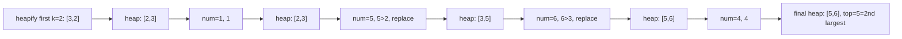

# 67. Kth Largest Element in an Array

## Problem

Given an unsorted array of integers and an integer `k`, find the kth largest element in the array. Note that it is the kth largest element in sorted order, not the kth distinct element.

## Example 1

### Input

```text
nums = [3,2,1,5,6,4], k = 2
```

### Expected Output

```text
5
```

### Explanation

Sorted descending: [6,5,4,3,2,1]. The 2nd largest is 5.

## Example 2

### Input

```text
nums = [3,2,3,1,2,4,5,5,6], k = 4
```

### Expected Output

```text
4
```

### Explanation

Sorted descending: [6,5,5,4,3,3,2,2,1]. The 4th largest is 4.

## How to Solve

### Key Idea

We only need the kth largest value, not a full sort. A min-heap of size k lets us track the k largest elements seen so far, and its smallest element is the answer.

### Approach

1. Build a min-heap containing the first k elements of the array.
2. For every remaining element, compare it to the heap's smallest value (the top).
3. If the element is larger, pop the smallest and push the new element in.
4. After processing all elements, the top of the heap is the kth largest.

### Why It Works

The heap always holds exactly the k largest values seen so far, and a min-heap's root is its smallest value — so the root is precisely the kth largest overall.

## Visual Explanation



## Optimal Solution

```python
import heapq

class Solution:
    def findKthLargest(self, nums: list[int], k: int) -> int:
        heap = nums[:k]
        heapq.heapify(heap)

        for num in nums[k:]:
            if num > heap[0]:
                heapq.heapreplace(heap, num)

        return heap[0]
```

## Complexity

- **Time:** O(n log k)
- **Space:** O(k) for the heap

## Real-World Uses

- Finding the kth highest bid in an auction without sorting all bids.
- Percentile-style queries over large datasets, like finding the kth highest sensor reading.
- Ranking systems that need the kth best score without a full leaderboard sort.

## Key Takeaway

For "kth largest/smallest" queries, a size-k heap is faster than sorting the whole array when k is much smaller than n.
