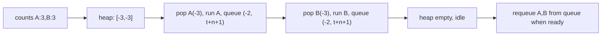

# 68. Task Scheduler

## Problem

You are given a list of tasks (letters) and a cooldown value `n`. The same task cannot be run again until `n` other units of time have passed (idle time counts). Each unit of time you either run one task or idle. Return the minimum number of time units needed to finish all tasks.

## Example 1

### Input

```text
tasks = ["A","A","A","B","B","B"], n = 2
```

### Expected Output

```text
8
```

### Explanation

One valid order: A -> B -> idle -> A -> B -> idle -> A -> B. That takes 8 units total.

## Example 2

### Input

```text
tasks = ["A","A","A","B","B","B"], n = 0
```

### Expected Output

```text
6
```

### Explanation

With no cooldown, tasks can run back-to-back: A A A B B B, taking exactly 6 units.

## How to Solve

### Key Idea

Always run the task with the highest remaining count first — this spreads out the most frequent task as much as possible and minimizes idle time. A max-heap tracks which task currently has the most remaining occurrences.

### Approach

1. Count how many times each task appears.
2. Push the negative counts into a max-heap (via negation).
3. Repeatedly process tasks in rounds of size `n + 1`: in each round, pop up to `n + 1` most frequent tasks, run them, decrement their counts, and push back any that still have remaining occurrences.
4. If a round has no tasks left to run for some slots, those slots are idle time.
5. Add up the total time units used until the heap and any pending queue are empty.

### Why It Works

By always choosing the most frequent remaining task, we prevent any single task from forcing extra idle time later. The cooldown window of `n+1` slots naturally batches how many distinct tasks we can interleave before repeating.

## Visual Explanation



## Optimal Solution

```python
import heapq
from collections import Counter, deque

class Solution:
    def leastInterval(self, tasks: list[str], n: int) -> int:
        counts = Counter(tasks)
        heap = [-c for c in counts.values()]
        heapq.heapify(heap)

        time = 0
        queue = deque()  # holds (count_remaining, time_it_can_be_reused)

        while heap or queue:
            time += 1
            if heap:
                count = 1 + heapq.heappop(heap)  # count is negative, so add 1 to reduce magnitude
                if count:
                    queue.append((count, time + n))

            if queue and queue[0][1] == time:
                count, _ = queue.popleft()
                heapq.heappush(heap, count)

        return time
```

## Complexity

- **Time:** O(n * log k) where k is the number of distinct tasks (at most 26)
- **Space:** O(k) for the heap and queue

## Real-World Uses

- CPU job schedulers that must run the highest-priority process while respecting cooldown or resource constraints.
- Rate-limited API call schedulers that spread out repeated requests to the same endpoint.
- Manufacturing or print job queues that need to space out repeated jobs on the same machine to avoid overheating or wear.

## Key Takeaway

When you need to repeatedly pick the "most frequent remaining" item under a spacing constraint, combine a max-heap (for priority) with a queue (to enforce the cooldown before re-adding).
