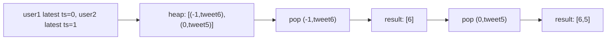

# 69. Design Twitter

## Problem

Design a simplified version of Twitter that lets users post tweets, follow and unfollow other users, and see the 10 most recent tweet IDs in their news feed (their own tweets plus tweets from people they follow), ordered from most recent to least recent.

## Example 1

### Input

```text
postTweet(1, 5)
getNewsFeed(1)
follow(1, 2)
postTweet(2, 6)
getNewsFeed(1)
unfollow(1, 2)
getNewsFeed(1)
```

### Expected Output

```text
[5]
[6, 5]
[5]
```

### Explanation

User 1 posts tweet 5, sees only [5]. User 1 follows user 2, who posts tweet 6. Now user 1's feed shows the newest first: [6, 5]. After unfollowing user 2, user 1's feed goes back to just their own tweet [5].

## Example 2

### Input

```text
postTweet(1, 3)
postTweet(1, 4)
getNewsFeed(1)
```

### Expected Output

```text
[4, 3]
```

### Explanation

User 1 posted tweet 3 then tweet 4. The feed shows the most recent tweet first, so [4, 3].

## How to Solve

### Key Idea

Each user's tweets are already in chronological order in their own list. To merge the tweets of a user and everyone they follow into one "most recent first" list, use a max-heap keyed by timestamp, similar to merging k sorted lists.

### Approach

1. Give every tweet a global timestamp (an incrementing counter) when it's posted, and store tweets per user as a list of `(timestamp, tweetId)`.
2. Keep a set of followees for each user (a user always "follows" themselves for feed purposes).
3. For `getNewsFeed(userId)`, gather the most recent tweets from the user and each followee, push them onto a max-heap (using negative timestamps), and pop the top 10.
4. For `follow`/`unfollow`, simply update the follower's set of followees.
5. For `postTweet`, append `(timestamp, tweetId)` to that user's tweet list and increment the global timestamp.

### Why It Works

Because each user's own tweet list is already sorted by time, treating the feed generation as a k-way merge (using a heap) efficiently retrieves the top 10 newest tweets across all relevant users without sorting everything.

## Visual Explanation



## Optimal Solution

```python
import heapq
from collections import defaultdict

class Twitter:
    def __init__(self):
        self.timestamp = 0
        self.tweets = defaultdict(list)   # userId -> list of (timestamp, tweetId)
        self.following = defaultdict(set)  # userId -> set of followee ids

    def postTweet(self, userId: int, tweetId: int) -> None:
        self.tweets[userId].append((self.timestamp, tweetId))
        self.timestamp += 1

    def getNewsFeed(self, userId: int) -> list[int]:
        heap = []
        users = self.following[userId] | {userId}

        for uid in users:
            if self.tweets[uid]:
                index = len(self.tweets[uid]) - 1
                ts, tweetId = self.tweets[uid][index]
                heapq.heappush(heap, (-ts, tweetId, uid, index - 1))

        result = []
        while heap and len(result) < 10:
            ts, tweetId, uid, index = heapq.heappop(heap)
            result.append(tweetId)
            if index >= 0:
                nts, ntweetId = self.tweets[uid][index]
                heapq.heappush(heap, (-nts, ntweetId, uid, index - 1))

        return result

    def follow(self, followerId: int, followeeId: int) -> None:
        if followerId != followeeId:
            self.following[followerId].add(followeeId)

    def unfollow(self, followerId: int, followeeId: int) -> None:
        self.following[followerId].discard(followeeId)
```

## Complexity

- **Time:** O(postTweet) = O(1); O(follow)/O(unfollow) = O(1); O(getNewsFeed) = O(U log U) where U is number of followees, since each heap push/pop is O(log U) and we do this up to 10 + U times
- **Space:** O(n) for all stored tweets, plus O(U) for follow relationships

## Real-World Uses

- Social media news-feed ranking that merges timelines from many followed accounts by recency.
- Chat apps merging message threads from multiple conversations into one unified recent-activity view.
- News aggregators combining articles from many sources into a single chronologically sorted feed.

## Key Takeaway

Merging several already-sorted lists (like each user's chronological tweets) into one combined "most recent" view is a classic k-way merge, and a heap is the natural tool for picking the next best element efficiently.
