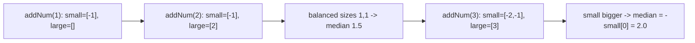

# 70. Find Median From Data Stream

## Problem

Design a data structure that supports adding numbers one at a time from a stream and can efficiently return the median of all numbers added so far. The median is the middle value in sorted order, or the average of the two middle values if the count is even.

## Example 1

### Input

```text
addNum(1)
addNum(2)
findMedian()
addNum(3)
findMedian()
```

### Expected Output

```text
1.5, 2.0
```

### Explanation

After adding 1 and 2, sorted values are [1,2], median is (1+2)/2 = 1.5. After adding 3, sorted values are [1,2,3], median is 2.0.

## Example 2

### Input

```text
addNum(5)
findMedian()
addNum(2)
addNum(9)
findMedian()
```

### Expected Output

```text
5.0, 5.0
```

### Explanation

After adding 5, median is 5.0. After adding 2 and 9, sorted values are [2,5,9], median is the middle value, 5.0.

## How to Solve

### Key Idea

Split all numbers into two heaps: a max-heap holding the smaller half, and a min-heap holding the larger half. Keep both heaps balanced in size so the median is always at the top of one (or both) heaps.

### Approach

1. Maintain `small` (a max-heap, via negation) for the lower half of numbers, and `large` (a min-heap) for the upper half.
2. When adding a number, push it onto `small` first, then move `small`'s largest value over to `large` to make sure every value in `small` is <= every value in `large`.
3. Rebalance sizes: if `large` has more elements than `small`, move `large`'s smallest back to `small`. Keep the size difference at most 1.
4. To find the median: if the heaps are equal in size, average their two tops. Otherwise, return the top of the larger heap (`small` always holds the extra element when sizes are unequal).

### Why It Works

Because `small` always contains the smallest half of numbers and `large` always contains the largest half, and their sizes differ by at most 1, the median is always found right at the boundary between the two heaps — no full sort needed.

## Visual Explanation



## Optimal Solution

```python
import heapq

class MedianFinder:
    def __init__(self):
        self.small = []  # max-heap (store negatives), holds the smaller half
        self.large = []  # min-heap, holds the larger half

    def addNum(self, num: int) -> None:
        heapq.heappush(self.small, -num)
        heapq.heappush(self.large, -heapq.heappop(self.small))

        if len(self.large) > len(self.small):
            heapq.heappush(self.small, -heapq.heappop(self.large))

    def findMedian(self) -> float:
        if len(self.small) > len(self.large):
            return float(-self.small[0])
        return (-self.small[0] + self.large[0]) / 2.0
```

## Complexity

- **Time:** O(log n) per `addNum`, O(1) per `findMedian`
- **Space:** O(n) to store all numbers across both heaps

## Real-World Uses

- Real-time analytics dashboards that display a running median of latency, response time, or sensor readings.
- Financial systems tracking a live median stock price or transaction amount as data streams in.
- Live A/B testing tools computing a running median metric without recomputing over the full dataset each time.

## Key Takeaway

The two-heap pattern (max-heap for the lower half, min-heap for the upper half, kept balanced) is the standard way to track a running median efficiently.
