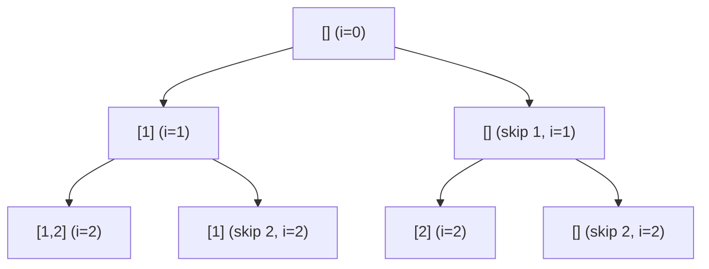

# 71. Subsets

## Problem

Given an array of unique integers, return every possible subset (the power set), including the empty set and the array itself. The order of subsets and the order of elements within a subset does not matter. The array length is usually small (up to about 10), since the number of subsets doubles with every extra element.

## Example 1

### Input

```text
nums = [1,2,3]
```

### Expected Output

```text
[[],[1],[2],[1,2],[3],[1,3],[2,3],[1,2,3]]
```

### Explanation

Every element can either be included or excluded, giving 2^3 = 8 possible subsets.

## Example 2

### Input

```text
nums = [0]
```

### Expected Output

```text
[[],[0]]
```

### Explanation

With one element there are only 2^1 = 2 subsets: the empty set and the set containing 0.

## How to Solve

### Key Idea

For each number, you have two choices: include it in the current subset, or don't. Trying both choices for every number, one at a time, generates all subsets.

### Approach

1. Use recursion (backtracking) with a starting index and a current path (the subset being built).
2. At each step, add the current path to the result list (every path is a valid subset).
3. Loop from the starting index to the end: add that number to the path, recurse on the next index, then remove it (backtrack) before trying the next number.

### Why It Works

Because we always record the path before adding more elements, and try adding every remaining number one at a time, we eventually visit every combination of included/excluded elements exactly once.

## Visual Explanation



## Optimal Solution

```python
from typing import List

class Solution:
    def subsets(self, nums: List[int]) -> List[List[int]]:
        result = []
        path = []

        def backtrack(start: int) -> None:
            result.append(path[:])
            for i in range(start, len(nums)):
                path.append(nums[i])
                backtrack(i + 1)
                path.pop()

        backtrack(0)
        return result
```

## Complexity

- **Time:** O(n * 2^n) — there are 2^n subsets, and copying each path takes O(n).
- **Space:** O(n) for the recursion stack and current path (output space not counted).

## Real-World Uses

- Generating all possible feature flag combinations to test during QA.
- Building all possible subsets of items for recommendation or bundling logic (e.g. gift set combinations).
- Enumerating configuration options in A/B testing setups.

## Key Takeaway

Subsets is the template for "include or exclude" backtracking: record the path at every node of the recursion tree, not just at the leaves.
