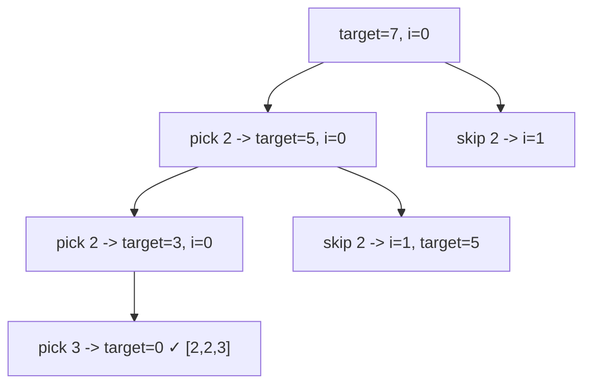

# 72. Combination Sum

## Problem

Given an array of distinct positive integers and a target, find all unique combinations of numbers that add up exactly to the target. The same number can be used an unlimited number of times. Return the combinations in any order, but each combination should be listed as a multiset (no duplicate combinations).

## Example 1

### Input

```text
candidates = [2,3,6,7], target = 7
```

### Expected Output

```text
[[2,2,3],[7]]
```

### Explanation

2+2+3 = 7 and 7 = 7. No other combination of these numbers adds up to 7.

## Example 2

### Input

```text
candidates = [2,3,5], target = 8
```

### Expected Output

```text
[[2,2,2,2],[2,3,3],[3,5]]
```

### Explanation

Each of these combinations sums to 8, reusing numbers as needed.

## How to Solve

### Key Idea

Try adding each candidate to the current combination, and since numbers can be reused, allow picking the same number again. Stop when the running sum reaches or exceeds the target.

### Approach

1. Use backtracking with a starting index, a current path, and a remaining target.
2. If remaining target is 0, save the current path as a valid combination.
3. If remaining target is negative, stop this path (it overshot).
4. Otherwise, loop from the starting index to the end: add the candidate, recurse with the same index (allowing reuse), then backtrack (remove it) before moving to the next candidate.

### Why It Works

Passing the same index forward (instead of index + 1) allows a number to be reused. Only moving to later indices avoids generating the same combination in a different order (e.g. [2,2,3] vs [2,3,2]).

## Visual Explanation



## Optimal Solution

```python
from typing import List

class Solution:
    def combinationSum(self, candidates: List[int], target: int) -> List[List[int]]:
        result = []
        path = []

        def backtrack(start: int, remaining: int) -> None:
            if remaining == 0:
                result.append(path[:])
                return
            if remaining < 0:
                return
            for i in range(start, len(candidates)):
                path.append(candidates[i])
                backtrack(i, remaining - candidates[i])
                path.pop()

        backtrack(0, target)
        return result
```

## Complexity

- **Time:** O(2^target) in the worst case (bounded by the number of ways to reach the target).
- **Space:** O(target / min(candidates)) for the recursion depth.

## Real-World Uses

- Finding all coin/denomination combinations that sum to a target payment amount.
- Generating valid ingredient combinations that meet a nutritional target.
- Computing ways to fill a shipping box to an exact weight or volume limit.

## Key Takeaway

When elements can be reused, recurse with the same starting index; when they can't, recurse with index + 1. This one detail is the difference between Combination Sum and Combination Sum II.
