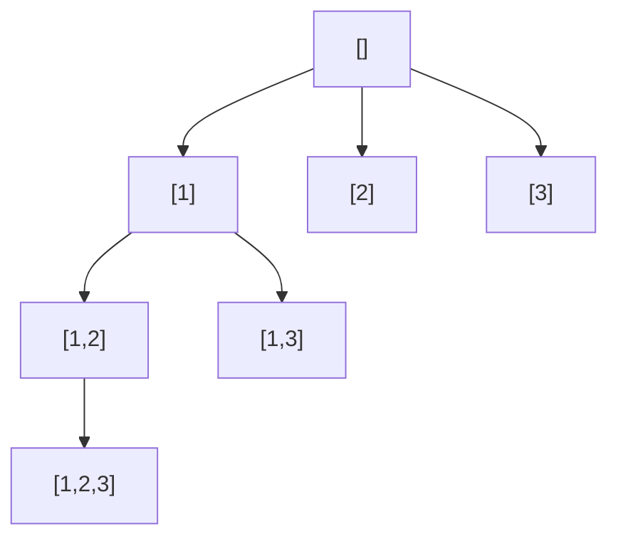

# 73. Permutations

## Problem

Given a collection of distinct integers, return every possible ordering (permutation) of them. If the input has n numbers, there are n! permutations to return.

## Example 1

### Input

```text
nums = [1,2,3]
```

### Expected Output

```text
[[1,2,3],[1,3,2],[2,1,3],[2,3,1],[3,1,2],[3,2,1]]
```

### Explanation

There are 3! = 6 ways to order three distinct numbers.

## Example 2

### Input

```text
nums = [0,1]
```

### Expected Output

```text
[[0,1],[1,0]]
```

### Explanation

There are 2! = 2 ways to order two distinct numbers.

## How to Solve

### Key Idea

Build each permutation one position at a time. At every position, try every number that hasn't been used yet in the current permutation.

### Approach

1. Use backtracking with a current path and a way to track which numbers are already used (a set or a boolean array).
2. If the path length equals the length of nums, save a copy of the path as a complete permutation.
3. Otherwise, loop through all numbers; skip ones already used, otherwise add the number to the path, mark it used, recurse, then remove it and mark it unused (backtrack).

### Why It Works

By trying every unused number at each position and undoing the choice afterward, we explore every possible ordering exactly once, systematically covering all n! arrangements.

## Visual Explanation



## Optimal Solution

```python
from typing import List

class Solution:
    def permute(self, nums: List[int]) -> List[List[int]]:
        result = []
        path = []
        used = [False] * len(nums)

        def backtrack() -> None:
            if len(path) == len(nums):
                result.append(path[:])
                return
            for i in range(len(nums)):
                if used[i]:
                    continue
                used[i] = True
                path.append(nums[i])
                backtrack()
                path.pop()
                used[i] = False

        backtrack()
        return result
```

## Complexity

- **Time:** O(n * n!) — there are n! permutations, each taking O(n) to build.
- **Space:** O(n) for the recursion stack, used array, and current path.

## Real-World Uses

- Generating all possible orderings of tasks to find an optimal schedule.
- Trying every seating or lineup arrangement for events or sports.
- Brute-forcing small cryptographic key or password orderings for testing.

## Key Takeaway

Unlike subsets, permutations care about order, so instead of only moving forward through the array, we scan all positions each time and track "used" elements to avoid repeats.
