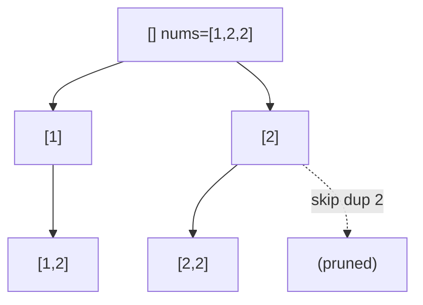

# 74. Subsets II

## Problem

Given an array of integers that may contain duplicate values, return all possible unique subsets (the power set), without duplicate subsets in the result. The order of subsets does not matter.

## Example 1

### Input

```text
nums = [1,2,2]
```

### Expected Output

```text
[[],[1],[1,2],[1,2,2],[2],[2,2]]
```

### Explanation

Even though 2 appears twice, subsets like [2] should only appear once in the output.

## Example 2

### Input

```text
nums = [0]
```

### Expected Output

```text
[[],[0]]
```

### Explanation

With a single element there are only 2 subsets: empty and [0].

## How to Solve

### Key Idea

Sort the array first so duplicate values sit next to each other. Then, at each recursion level, skip a number if it's the same as the previous number we already tried at that same level, since that would recreate a subset we already generated.

### Approach

1. Sort nums so equal values are adjacent.
2. Use backtracking with a starting index and current path; add the current path to the result at every node (same as Subsets).
3. Loop from the starting index; skip an index if it's not the first choice at this level and nums[i] == nums[i-1] (i > start), since that path was already explored.
4. Otherwise include nums[i], recurse on i + 1, then backtrack.

### Why It Works

Sorting groups duplicates together. Skipping a repeated value at the same recursion depth (not skipping it across different depths) prevents generating the same subset twice, while still allowing subsets that use the duplicate multiple times (like [2,2]) through deeper recursion.

## Visual Explanation



## Optimal Solution

```python
from typing import List

class Solution:
    def subsetsWithDup(self, nums: List[int]) -> List[List[int]]:
        nums.sort()
        result = []
        path = []

        def backtrack(start: int) -> None:
            result.append(path[:])
            for i in range(start, len(nums)):
                if i > start and nums[i] == nums[i - 1]:
                    continue
                path.append(nums[i])
                backtrack(i + 1)
                path.pop()

        backtrack(0)
        return result
```

## Complexity

- **Time:** O(n * 2^n) in the worst case.
- **Space:** O(n) for recursion depth and current path (output space not counted).

## Real-World Uses

- Generating unique product bundle options when the catalog has duplicate-priced items.
- Producing distinct test data combinations from a list with repeated values.
- Enumerating unique discount stacking combinations from a set of overlapping coupons.

## Key Takeaway

The "sort, then skip same value at the same recursion depth" trick is the standard way to remove duplicates in backtracking problems — it appears again in Combination Sum II.
