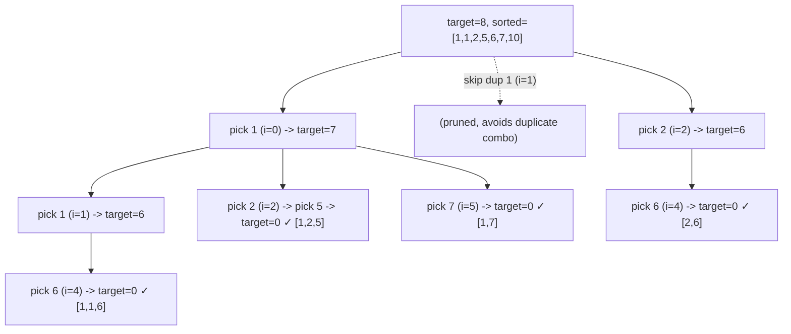

# 75. Combination Sum II

## Problem

Given a collection of numbers that may contain duplicates and a target, find all unique combinations where the numbers add up to the target. Unlike Combination Sum, each number in the input may only be used once per combination. The result must not contain duplicate combinations.

## Example 1

### Input

```text
candidates = [10,1,2,7,6,1,5], target = 8
```

### Expected Output

```text
[[1,1,6],[1,2,5],[1,7],[2,6]]
```

### Explanation

These are all the unique combinations from the list (using each number at most as many times as it appears) that sum to 8.

## Example 2

### Input

```text
candidates = [2,5,2,1,2], target = 5
```

### Expected Output

```text
[[1,2,2],[5]]
```

### Explanation

1+2+2 = 5 and 5 = 5. There are three 2's available, so using two of them is allowed.

## How to Solve

### Key Idea

Sort the array so duplicates are adjacent. Use each number only once by moving to the next index after using it, and skip duplicate numbers at the same recursion depth so the same combination isn't produced twice.

### Approach

1. Sort candidates.
2. Backtrack with a starting index, current path, and remaining target.
3. If remaining is 0, save the path. If remaining is negative or we run out of numbers, stop.
4. Loop from start to end; skip if i > start and candidates[i] == candidates[i-1] (avoids duplicate combos); otherwise add candidates[i], recurse from i + 1 (not i, since each number is used once), then backtrack.

### Why It Works

Recursing from i + 1 (instead of i) enforces "use each element once." Skipping repeated values at the same depth (but allowing them at deeper levels) ensures we don't generate the same set of numbers twice, even though the array has duplicate values.

## Visual Explanation



## Optimal Solution

```python
from typing import List

class Solution:
    def combinationSum2(self, candidates: List[int], target: int) -> List[List[int]]:
        candidates.sort()
        result = []
        path = []

        def backtrack(start: int, remaining: int) -> None:
            if remaining == 0:
                result.append(path[:])
                return
            if remaining < 0:
                return
            for i in range(start, len(candidates)):
                if i > start and candidates[i] == candidates[i - 1]:
                    continue
                if candidates[i] > remaining:
                    break
                path.append(candidates[i])
                backtrack(i + 1, remaining - candidates[i])
                path.pop()

        backtrack(0, target)
        return result
```

## Complexity

- **Time:** O(2^n) in the worst case, where n is the number of candidates.
- **Space:** O(n) for recursion depth and current path.

## Real-World Uses

- Finding valid one-time-use coupon combinations that reach an exact discount target.
- Selecting a unique set of inventory items (each usable once) to match an order quantity.
- Computing distinct ways to allocate a fixed budget across a list of one-time expenses.

## Key Takeaway

Combination Sum II combines two backtracking tricks: recurse from i + 1 to use each element once, and skip same-value siblings at the same depth to avoid duplicate results.
