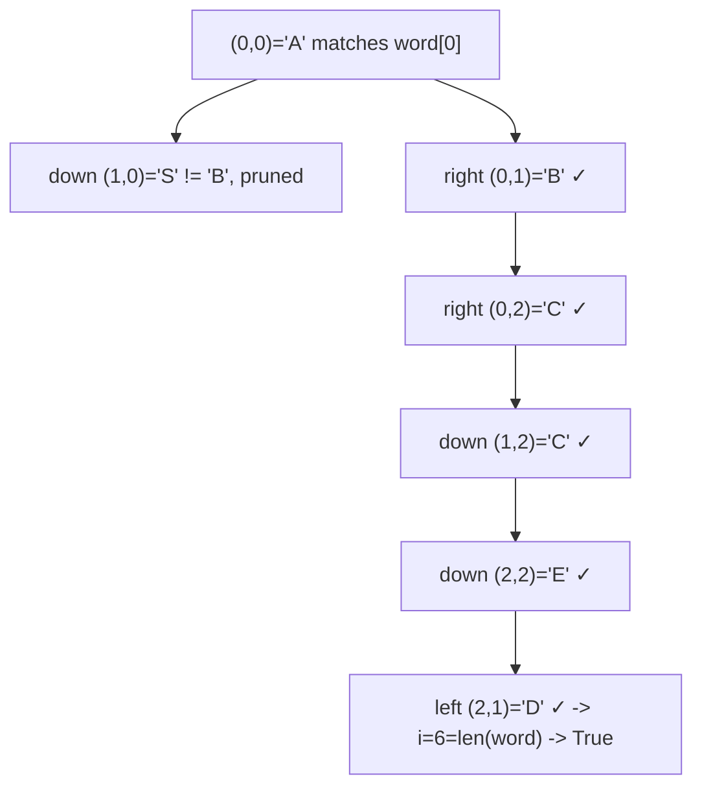

# 76. Word Search

## Problem

Given an m x n grid of characters and a word, determine if the word can be constructed by connecting adjacent cells (up, down, left, or right — not diagonally). Each cell can only be used once per word.

## Example 1

### Input

```text
board = [["A","B","C","E"],
         ["S","F","C","S"],
         ["A","D","E","E"]]
word = "ABCCED"
```

### Expected Output

```text
true
```

### Explanation

Starting at A(0,0) -> B(0,1) -> C(0,2) -> C(1,2) -> E(2,2) -> D(2,1) traces out "ABCCED" using adjacent cells.

## Example 2

### Input

```text
board = [["A","B","C","E"],
         ["S","F","C","S"],
         ["A","D","E","E"]]
word = "ABCB"
```

### Expected Output

```text
false
```

### Explanation

After A -> B -> C, there is no unused adjacent "B" left to continue the path (the only B is already used).

## How to Solve

### Key Idea

Try starting the search from every cell that matches the first letter, and explore in all four directions, backtracking (undoing a visited mark) whenever a path doesn't pan out.

### Approach

1. For each cell in the grid, if it matches word[0], start a depth-first search from there.
2. In the search, if the current character matches word[index], mark the cell as visited (e.g. temporarily change it), then try all 4 neighboring directions for word[index + 1].
3. If index reaches the length of the word, we found a full match — return true.
4. After trying all directions from a cell, unmark it (restore the original character) so other paths can use it — this is the backtracking step.
5. Return true if any starting cell leads to a full match, otherwise false.

### Why It Works

Marking a cell as visited during the current path prevents reusing it, and restoring it after exploring ensures other, unrelated paths can still use that cell. Trying every starting position and every direction guarantees we don't miss a valid path if one exists.

## Visual Explanation



## Optimal Solution

```python
from typing import List

class Solution:
    def exist(self, board: List[List[str]], word: str) -> bool:
        rows, cols = len(board), len(board[0])

        def backtrack(r: int, c: int, i: int) -> bool:
            if i == len(word):
                return True
            if r < 0 or r >= rows or c < 0 or c >= cols or board[r][c] != word[i]:
                return False

            temp = board[r][c]
            board[r][c] = "#"

            found = (
                backtrack(r + 1, c, i + 1)
                or backtrack(r - 1, c, i + 1)
                or backtrack(r, c + 1, i + 1)
                or backtrack(r, c - 1, i + 1)
            )

            board[r][c] = temp
            return found

        for r in range(rows):
            for c in range(cols):
                if backtrack(r, c, 0):
                    return True
        return False
```

## Complexity

- **Time:** O(m * n * 4^L), where L is the length of the word (each cell of L can branch into up to 4 directions).
- **Space:** O(L) for the recursion stack.

## Real-World Uses

- Word-search and Boggle-style puzzle games checking if a word can be traced on the board.
- Pathfinding in grid-based games where a route must satisfy a sequence of conditions.
- Circuit or maze validation where a trace must follow a specific pattern through cells.

## Key Takeaway

Grid backtracking follows a common pattern: mark the current cell as "in use," explore all directions, then unmark it before returning — this "mark, explore, unmark" cycle is the core of most maze/grid search problems.
