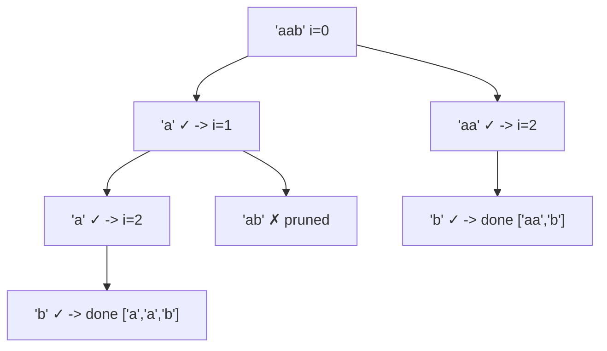

# 77. Palindrome Partitioning

## Problem

Given a string, split it into pieces (a partition) such that every piece is a palindrome. Return all the possible ways to partition the string this way. A palindrome reads the same forwards and backwards.

## Example 1

### Input

```text
s = "aab"
```

### Expected Output

```text
[["a","a","b"],["aa","b"]]
```

### Explanation

Both ["a","a","b"] and ["aa","b"] split "aab" into pieces that are each palindromes.

## Example 2

### Input

```text
s = "a"
```

### Expected Output

```text
[["a"]]
```

### Explanation

A single character is always a palindrome, so the only partition is the whole string as one piece.

## How to Solve

### Key Idea

At each position in the string, try every possible next "cut" — as long as the substring from the current position to the cut is a palindrome, take that cut and recurse on the rest of the string.

### Approach

1. Use backtracking with a starting index and a current path (list of palindrome pieces so far).
2. If the starting index reaches the end of the string, the path is a full valid partition — save it.
3. Otherwise, try every end index from start+1 to the end of the string; if s[start:end] is a palindrome, add it to the path, recurse with start = end, then backtrack (remove it).

### Why It Works

By only recursing further when the current piece is a palindrome, we guarantee every piece in a final saved path is a palindrome. Trying every possible cut length at each position ensures every valid partition is discovered.

## Visual Explanation



## Optimal Solution

```python
from typing import List

class Solution:
    def partition(self, s: str) -> List[List[str]]:
        result = []
        path = []

        def is_palindrome(sub: str) -> bool:
            return sub == sub[::-1]

        def backtrack(start: int) -> None:
            if start == len(s):
                result.append(path[:])
                return
            for end in range(start + 1, len(s) + 1):
                piece = s[start:end]
                if is_palindrome(piece):
                    path.append(piece)
                    backtrack(end)
                    path.pop()

        backtrack(0)
        return result
```

## Complexity

- **Time:** O(n * 2^n) — up to 2^n ways to partition a string of length n, each check taking O(n).
- **Space:** O(n) for the recursion stack and current path.

## Real-World Uses

- DNA sequence analysis to find all ways a strand splits into palindromic segments.
- Text-processing tools that detect and segment palindromic patterns for puzzles or word games.
- Data validation pipelines that partition strings into valid, symmetric chunks (e.g. checksums).

## Key Takeaway

Partitioning problems use the same "choose where to cut, recurse on the rest" backtracking shape as combination problems — the only twist here is validating each piece (palindrome check) before recursing.
