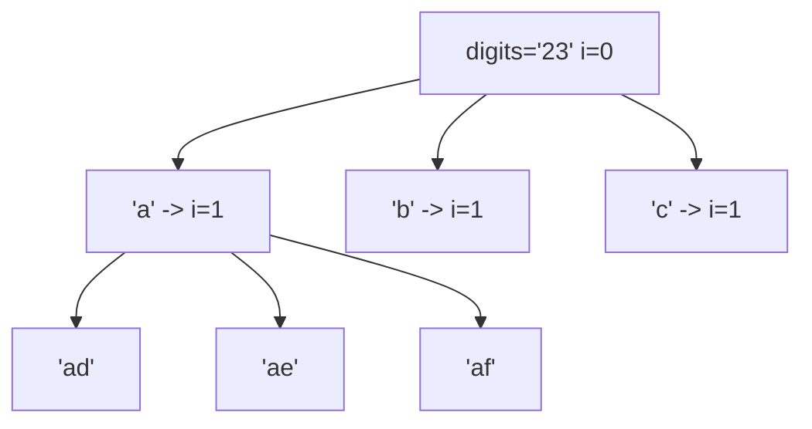

# 78. Letter Combinations of a Phone Number

## Problem

Given a string of digits from 2 to 9, return all possible letter combinations that the digits could represent, based on a standard telephone keypad mapping (like 2 = "abc", 3 = "def", and so on). Return the combinations in any order. If the input is empty, return an empty list.

## Example 1

### Input

```text
digits = "23"
```

### Expected Output

```text
["ad","ae","af","bd","be","bf","cd","ce","cf"]
```

### Explanation

2 maps to "abc" and 3 maps to "def", so every letter of "abc" is paired with every letter of "def".

## Example 2

### Input

```text
digits = ""
```

### Expected Output

```text
[]
```

### Explanation

There are no digits, so there are no combinations to form.

## How to Solve

### Key Idea

Each digit contributes one letter to the final string. Pick one letter for the current digit, then recurse to pick a letter for the next digit, building the string one character at a time.

### Approach

1. Build a mapping from each digit to its letters (2 -> "abc", 3 -> "def", etc).
2. If digits is empty, return an empty list right away.
3. Backtrack with an index and a current string path: if the index equals the length of digits, save the path as a complete combination.
4. Otherwise, look up the letters for digits[index], and for each letter, add it to the path, recurse on index + 1, then remove it (backtrack).

### Why It Works

Since every digit must contribute exactly one letter, and we try every letter option for each digit position while keeping earlier choices fixed, we systematically generate every possible combination exactly once.

## Visual Explanation



## Optimal Solution

```python
from typing import List

class Solution:
    def letterCombinations(self, digits: str) -> List[str]:
        if not digits:
            return []

        digit_to_letters = {
            "2": "abc", "3": "def", "4": "ghi", "5": "jkl",
            "6": "mno", "7": "pqrs", "8": "tuv", "9": "wxyz",
        }

        result = []
        path = []

        def backtrack(index: int) -> None:
            if index == len(digits):
                result.append("".join(path))
                return
            for letter in digit_to_letters[digits[index]]:
                path.append(letter)
                backtrack(index + 1)
                path.pop()

        backtrack(0)
        return result
```

## Complexity

- **Time:** O(4^n * n), where n is the number of digits (up to 4 letters per digit, and joining takes O(n)).
- **Space:** O(n) for the recursion stack and current path.

## Real-World Uses

- Old phone-keypad (T9) text input generating candidate words from digit presses.
- Generating all possible license plate or product code strings from allowed character sets per position.
- Autocomplete/predictive text systems exploring candidate strings from ambiguous input.

## Key Takeaway

This is backtracking over a fixed number of positions (one per digit), where each position has a small fixed set of choices — a simpler shape than problems with variable-length choices.
