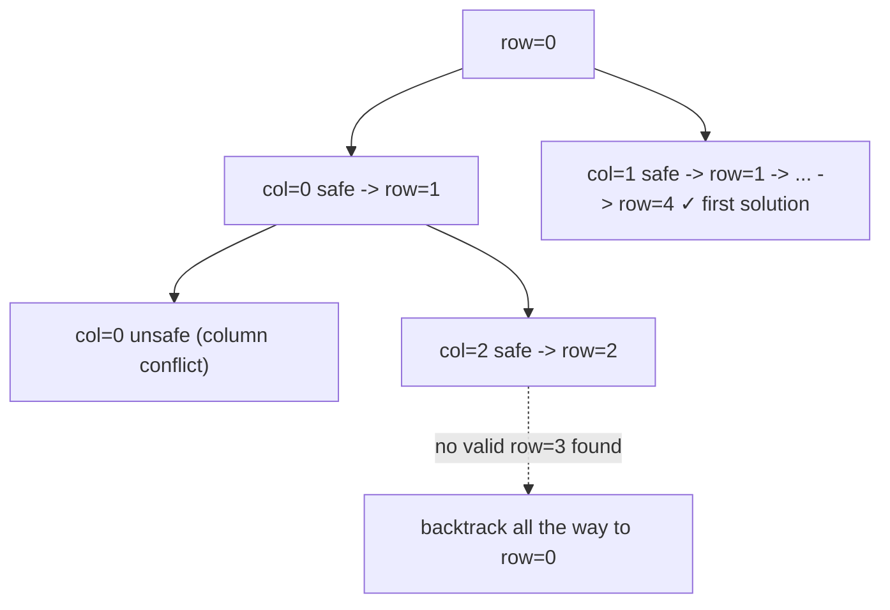

# 79. N-Queens

## Problem

Given an integer n, place n queens on an n x n chessboard so that no two queens attack each other (no two share a row, column, or diagonal). Return all distinct board arrangements, where each arrangement is shown as a list of strings with 'Q' for a queen and '.' for an empty space.

## Example 1

### Input

```text
n = 4
```

### Expected Output

```text
[[".Q..","...Q","Q...","..Q."],
 ["..Q.","Q...","...Q",".Q.."]]
```

### Explanation

These are the only two ways to place 4 queens on a 4x4 board with no two attacking each other.

## Example 2

### Input

```text
n = 1
```

### Expected Output

```text
[["Q"]]
```

### Explanation

With only one queen and one square, there is exactly one valid arrangement.

## How to Solve

### Key Idea

Place one queen per row. For each row, try every column, and only keep a placement if it doesn't conflict with queens already placed in previous rows (same column or same diagonal).

### Approach

1. Backtrack row by row, starting at row 0. Keep track of which columns and which diagonals are already occupied (using sets for fast lookup).
2. If we've successfully placed a queen in every row (row == n), save the current board as a valid solution.
3. Otherwise, for each column in the current row, check if that column, or either diagonal through that cell, is already used.
4. If it's safe, place the queen (mark column/diagonals used, record position), recurse to the next row, then remove the queen (backtrack, unmark column/diagonals) before trying the next column.

### Why It Works

Placing exactly one queen per row automatically avoids row conflicts. Tracking used columns and diagonals lets us instantly check column/diagonal conflicts without rescanning the board. Trying every column at every row and undoing failed choices explores all valid arrangements.

## Visual Explanation



## Optimal Solution

```python
from typing import List

class Solution:
    def solveNQueens(self, n: int) -> List[List[str]]:
        result = []
        col_positions = [-1] * n
        used_cols = set()
        used_diag1 = set()  # row - col
        used_diag2 = set()  # row + col

        def build_board() -> List[str]:
            board = []
            for col in col_positions:
                row_str = "." * col + "Q" + "." * (n - col - 1)
                board.append(row_str)
            return board

        def backtrack(row: int) -> None:
            if row == n:
                result.append(build_board())
                return
            for col in range(n):
                if col in used_cols or (row - col) in used_diag1 or (row + col) in used_diag2:
                    continue
                col_positions[row] = col
                used_cols.add(col)
                used_diag1.add(row - col)
                used_diag2.add(row + col)

                backtrack(row + 1)

                used_cols.remove(col)
                used_diag1.remove(row - col)
                used_diag2.remove(row + col)

        backtrack(0)
        return result
```

## Complexity

- **Time:** O(n!) in the worst case — each row has fewer valid column choices than the last.
- **Space:** O(n) for the sets, column positions, and recursion stack (output space not counted).

## Real-World Uses

- Constraint-satisfaction problems like classroom or exam scheduling with conflicting time slots.
- Puzzle solvers (Sudoku, logic grid puzzles) that place items under row/column/region constraints.
- Resource allocation where placements must avoid interference, such as wireless channel assignment.

## Key Takeaway

N-Queens shows how backtracking scales up with smarter pruning: instead of checking the whole board for conflicts, tracking used columns and diagonals in sets lets each placement check happen in constant time.
