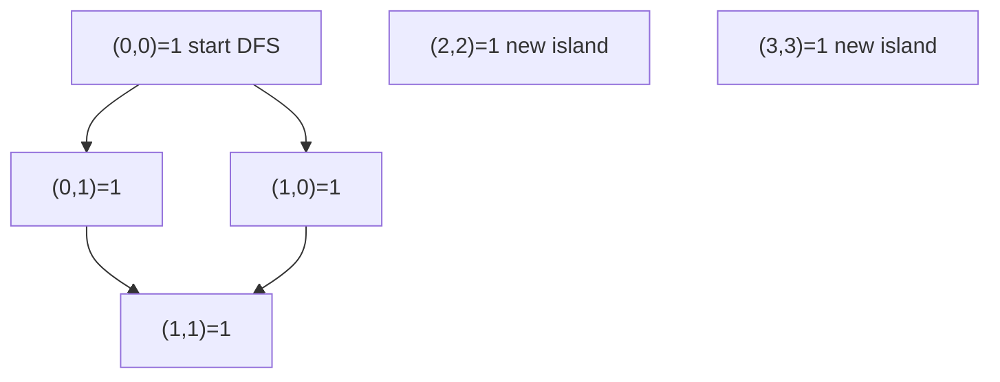

# 80. Number of Islands

## Problem

You are given a grid of `'1'` (land) and `'0'` (water). An island is a group of land cells connected horizontally or vertically. Count how many separate islands exist in the grid.

## Example 1

### Input

```text
grid = [
  ["1","1","0","0"],
  ["1","1","0","0"],
  ["0","0","1","0"],
  ["0","0","0","1"]
]
```

### Expected Output

```text
3
```

### Explanation

There is one big island in the top-left corner, and two single-cell islands.

## Example 2

### Input

```text
grid = [
  ["1","0","1"],
  ["0","0","0"],
  ["1","0","1"]
]
```

### Expected Output

```text
4
```

### Explanation

Each '1' is isolated from the others, so each one is its own island.

## How to Solve

### Key Idea

Every time you find an unvisited land cell, it's the start of a new island. Sink the whole island using DFS or BFS so you don't count it again.

### Approach

1. Loop through every cell in the grid.
2. When you find a `'1'` that hasn't been visited, increase the island count by 1.
3. Run DFS (or BFS) from that cell, marking every connected `'1'` as visited so it's not counted again.

### Why It Works

Once you enter DFS from a land cell, it explores and marks the entire connected island, so the outer loop can never accidentally count the same island twice.

## Visual Explanation



## Optimal Solution

```python
class Solution:
    def numIslands(self, grid: list[list[str]]) -> int:
        if not grid:
            return 0

        rows, cols = len(grid), len(grid[0])
        visited = set()
        islands = 0

        def dfs(r, c):
            stack = [(r, c)]
            visited.add((r, c))
            while stack:
                row, col = stack.pop()
                for dr, dc in [(1,0),(-1,0),(0,1),(0,-1)]:
                    nr, nc = row + dr, col + dc
                    if (0 <= nr < rows and 0 <= nc < cols and
                            grid[nr][nc] == "1" and (nr, nc) not in visited):
                        visited.add((nr, nc))
                        stack.append((nr, nc))

        for r in range(rows):
            for c in range(cols):
                if grid[r][c] == "1" and (r, c) not in visited:
                    islands += 1
                    dfs(r, c)

        return islands
```

## Complexity

- **Time:** O(rows * cols)
- **Space:** O(rows * cols)

## Real-World Uses

- Image segmentation: grouping adjacent pixels of the same region (e.g. medical scan analysis).
- Detecting connected land masses or regions in satellite/GIS mapping data.
- Finding connected clusters in a pixel-based game map or maze editor.

## Key Takeaway

This is the classic "flood fill" pattern for grid problems: use DFS/BFS to mark connected components and count how many times you start a fresh search.
