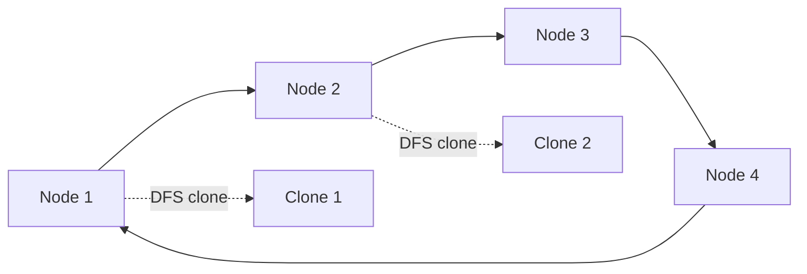

# 81. Clone Graph

## Problem

You are given a reference to a node in a connected undirected graph, where each node has a value and a list of neighbors. Return a deep copy (clone) of the entire graph, so no node in the copy shares an object with the original graph.

## Example 1

### Input

```text
adjList = [[2,4],[1,3],[2,4],[1,3]]
```

### Expected Output

```text
[[2,4],[1,3],[2,4],[1,3]]
```

### Explanation

Node 1 connects to nodes 2 and 4, node 2 connects to nodes 1 and 3, and so on. The cloned graph has the same structure but is made of entirely new node objects.

## Example 2

### Input

```text
adjList = [[]]
```

### Expected Output

```text
[[]]
```

### Explanation

The graph has a single node with no neighbors, so the clone is just one new empty node.

## How to Solve

### Key Idea

Use a hash map to remember which original node maps to which cloned node, so you never clone the same node twice and can safely handle cycles.

### Approach

1. Start DFS (or BFS) from the given node.
2. If the node is already in the map, return its existing clone.
3. Otherwise, create a new clone, store it in the map immediately (before recursing), then recursively clone all its neighbors and attach them.

### Why It Works

Storing the clone in the map before visiting neighbors prevents infinite loops when the graph has cycles, since revisiting a node just returns the already-created clone.

## Visual Explanation



## Optimal Solution

```python
class Node:
    def __init__(self, val=0, neighbors=None):
        self.val = val
        self.neighbors = neighbors if neighbors is not None else []


class Solution:
    def cloneGraph(self, node: "Node") -> "Node":
        if not node:
            return None

        old_to_new = {}

        def dfs(n):
            if n in old_to_new:
                return old_to_new[n]

            copy = Node(n.val)
            old_to_new[n] = copy
            for neighbor in n.neighbors:
                copy.neighbors.append(dfs(neighbor))

            return copy

        return dfs(node)
```

## Complexity

- **Time:** O(V + E), where V is nodes and E is edges
- **Space:** O(V)

## Real-World Uses

- Deep-copying object graphs in serialization/deserialization libraries.
- Duplicating a scene graph in game engines or UI component trees.
- Cloning network topology models for simulation without affecting the live graph.

## Key Takeaway

Whenever you need to duplicate a graph-like structure, pair DFS/BFS with a hash map from old node to new node — this is the standard way to handle cycles safely.
