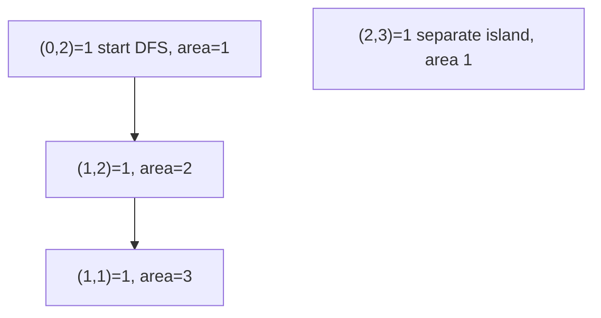

# 82. Max Area of Island

## Problem

You are given a grid of `0`s (water) and `1`s (land). An island is a group of `1`s connected horizontally or vertically. Return the area (number of cells) of the largest island. If there is no island, return 0.

## Example 1

### Input

```text
grid = [
  [0,0,1,0],
  [0,1,1,0],
  [0,0,0,1]
]
```

### Expected Output

```text
3
```

### Explanation

The island made of the three connected 1s in the top-middle area has size 3, which is the largest.

## Example 2

### Input

```text
grid = [
  [0,0,0],
  [0,0,0]
]
```

### Expected Output

```text
0
```

### Explanation

There is no land in the grid, so the largest island size is 0.

## How to Solve

### Key Idea

Same flood-fill idea as counting islands, but instead of just counting islands, count the cells in each island and keep track of the maximum.

### Approach

1. Loop through every cell in the grid.
2. When you find an unvisited land cell, run DFS from it, counting how many connected cells it covers.
3. Update the running maximum with the area of that island.

### Why It Works

DFS/BFS from a starting land cell visits exactly the cells belonging to that one connected island, so counting the visited cells gives that island's true area.

## Visual Explanation



## Optimal Solution

```python
class Solution:
    def maxAreaOfIsland(self, grid: list[list[int]]) -> int:
        rows, cols = len(grid), len(grid[0])
        visited = set()

        def dfs(r, c):
            if (r < 0 or r >= rows or c < 0 or c >= cols or
                    grid[r][c] == 0 or (r, c) in visited):
                return 0

            visited.add((r, c))
            area = 1
            for dr, dc in [(1,0),(-1,0),(0,1),(0,-1)]:
                area += dfs(r + dr, c + dc)
            return area

        max_area = 0
        for r in range(rows):
            for c in range(cols):
                if grid[r][c] == 1 and (r, c) not in visited:
                    max_area = max(max_area, dfs(r, c))

        return max_area
```

## Complexity

- **Time:** O(rows * cols)
- **Space:** O(rows * cols)

## Real-World Uses

- Measuring the size of contiguous regions in image analysis (e.g. largest tumor region in a scan).
- Estimating the largest connected landmass or forest patch from satellite imagery.
- Finding the biggest connected cluster of active cells in cellular automata or game-of-life simulations.

## Key Takeaway

Once you know the flood-fill pattern, tracking a size or sum during the traversal (instead of just marking visited) lets you solve area/size variants of island problems easily.
