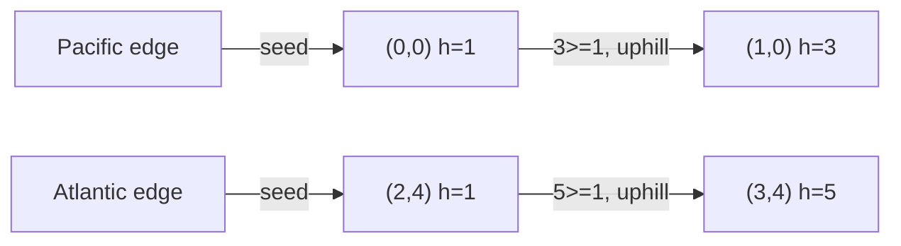

# 83. Pacific Atlantic Water Flow

## Problem

You have a grid of heights representing an island. The Pacific Ocean touches the top and left edges, and the Atlantic Ocean touches the bottom and right edges. Water can flow from a cell to a neighboring cell only if the neighbor's height is less than or equal to the current cell's height. Return the list of cells from which water can reach both oceans.

## Example 1

### Input

```text
heights = [
  [1,2,2,3,5],
  [3,2,3,4,4],
  [2,4,5,3,1],
  [6,7,1,4,5],
  [5,1,1,2,4]
]
```

### Expected Output

```text
[[0,4],[1,3],[1,4],[2,2],[3,0],[3,1],[4,0]]
```

### Explanation

Each of these cells can send water uphill-free paths to both the top/left edges and the bottom/right edges.

## Example 2

### Input

```text
heights = [[1]]
```

### Expected Output

```text
[[0,0]]
```

### Explanation

The single cell touches both oceans at once, so it always counts.

## How to Solve

### Key Idea

Instead of checking, for every cell, whether water can flow all the way to both oceans (slow), work backwards: start from the ocean edges and walk "uphill" (or equal) to find every cell that can reach that ocean.

### Approach

1. Run a DFS/BFS from every cell on the Pacific edges (top row and left column), moving to neighbors with height >= current, marking all reachable cells as "reaches Pacific".
2. Do the same from the Atlantic edges (bottom row and right column) to mark cells that "reach Atlantic".
3. The answer is every cell that is marked in both sets.

### Why It Works

Flowing downhill from a cell to the ocean is the same as flowing uphill from the ocean back to that cell, so reversing the direction lets you compute reachability from each ocean with one traversal instead of one traversal per cell.

## Visual Explanation



## Optimal Solution

```python
class Solution:
    def pacificAtlantic(self, heights: list[list[int]]) -> list[list[int]]:
        if not heights:
            return []

        rows, cols = len(heights), len(heights[0])
        pacific, atlantic = set(), set()

        def dfs(r, c, visited, prev_height):
            if (r < 0 or r >= rows or c < 0 or c >= cols or
                    (r, c) in visited or heights[r][c] < prev_height):
                return

            visited.add((r, c))
            for dr, dc in [(1,0),(-1,0),(0,1),(0,-1)]:
                dfs(r + dr, c + dc, visited, heights[r][c])

        for c in range(cols):
            dfs(0, c, pacific, heights[0][c])
            dfs(rows - 1, c, atlantic, heights[rows - 1][c])

        for r in range(rows):
            dfs(r, 0, pacific, heights[r][0])
            dfs(r, cols - 1, atlantic, heights[r][cols - 1])

        return [[r, c] for r in range(rows) for c in range(cols)
                if (r, c) in pacific and (r, c) in atlantic]
```

## Complexity

- **Time:** O(rows * cols)
- **Space:** O(rows * cols)

## Real-World Uses

- Watershed and drainage modeling in hydrology and terrain analysis.
- Reverse reachability analysis in network routing (which nodes can reach a set of destinations).
- Simulating runoff or flood-risk zones from elevation maps in urban planning.

## Key Takeaway

When a problem asks "which cells can reach X", it's often faster to flip the direction and search "from X, which cells can be reached" — this turns many expensive per-cell searches into two cheap traversals.
