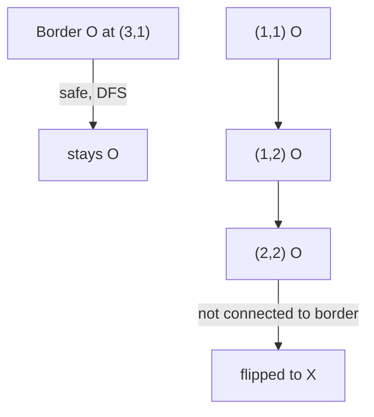

# 84. Surrounded Regions

## Problem

You are given a grid of `'X'` and `'O'`. Capture (flip to `'X'`) every region of `'O'` that is completely surrounded by `'X'` on all sides. Any `'O'` connected to the border (directly or through other `'O'`s) is NOT surrounded and must stay `'O'`. Modify the grid in place.

## Example 1

### Input

```text
board = [
  ["X","X","X","X"],
  ["X","O","O","X"],
  ["X","X","O","X"],
  ["X","O","X","X"]
]
```

### Expected Output

```text
[
  ["X","X","X","X"],
  ["X","X","X","X"],
  ["X","X","X","X"],
  ["X","O","X","X"]
]
```

### Explanation

The 'O's in the middle are fully enclosed by 'X', so they get flipped. The 'O' at the bottom row touches the border, so it stays.

## Example 2

### Input

```text
board = [["X"]]
```

### Expected Output

```text
[["X"]]
```

### Explanation

There are no 'O' cells, so nothing changes.

## How to Solve

### Key Idea

Any 'O' touching the border can never be captured, and neither can anything connected to it. So find those "safe" O's first, then capture everything else.

### Approach

1. Run DFS/BFS from every 'O' on the border, marking all connected 'O's as "safe".
2. Loop through the whole grid: flip every 'O' that is not marked safe into 'X'.
3. Flip the "safe" markers back to 'O' (since they should remain unchanged).

### Why It Works

Only O's reachable from the border can escape being surrounded, so marking them first lets you safely convert every other O to X without accidentally destroying an unsurrounded region.

## Visual Explanation



## Optimal Solution

```python
class Solution:
    def solve(self, board: list[list[str]]) -> None:
        if not board:
            return

        rows, cols = len(board), len(board[0])

        def dfs(r, c):
            if (r < 0 or r >= rows or c < 0 or c >= cols or
                    board[r][c] != "O"):
                return
            board[r][c] = "#"
            for dr, dc in [(1,0),(-1,0),(0,1),(0,-1)]:
                dfs(r + dr, c + dc)

        for r in range(rows):
            dfs(r, 0)
            dfs(r, cols - 1)
        for c in range(cols):
            dfs(0, c)
            dfs(rows - 1, c)

        for r in range(rows):
            for c in range(cols):
                if board[r][c] == "O":
                    board[r][c] = "X"
                elif board[r][c] == "#":
                    board[r][c] = "O"
```

## Complexity

- **Time:** O(rows * cols)
- **Space:** O(rows * cols)

## Real-World Uses

- Image processing: filling enclosed holes in a shape while preserving background connected to the border.
- Detecting enclosed "dead" regions in board games like Go.
- Identifying isolated internal cavities in CAD/mesh models versus the exterior surface.

## Key Takeaway

When a problem cares about cells connected to the border vs. everything else, start your traversal from the border — it's usually easier than trying to detect "enclosed" regions directly.
