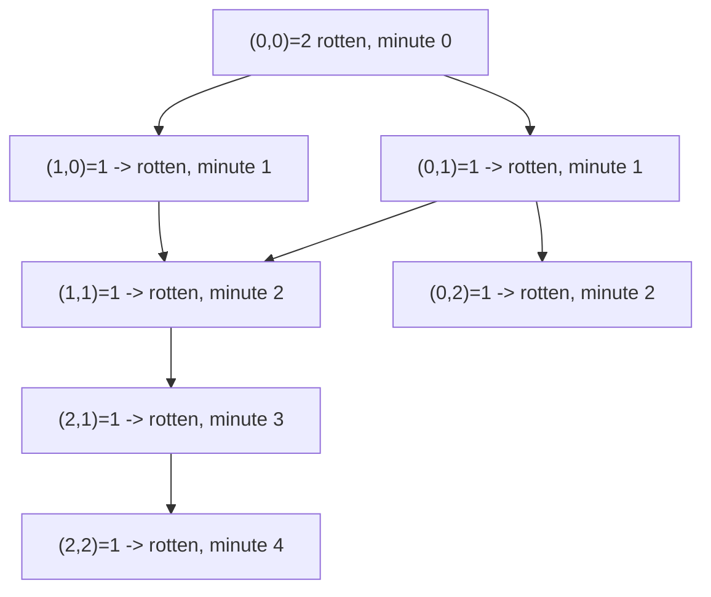

# 85. Rotting Oranges

## Problem

You are given a grid where each cell is `0` (empty), `1` (fresh orange), or `2` (rotten orange). Every minute, any fresh orange adjacent (up/down/left/right) to a rotten orange becomes rotten too. Return the minimum number of minutes until no fresh orange remains, or `-1` if that's impossible.

## Example 1

### Input

```text
grid = [
  [2,1,1],
  [1,1,0],
  [0,1,1]
]
```

### Expected Output

```text
4
```

### Explanation

The rot spreads outward one layer per minute from the initial rotten orange until every fresh orange is rotten.

## Example 2

### Input

```text
grid = [[0,2]]
```

### Expected Output

```text
0
```

### Explanation

There are no fresh oranges to begin with, so 0 minutes are needed.

## How to Solve

### Key Idea

This is a multi-source BFS: start the spread from all rotten oranges at once, and each BFS "layer" represents exactly one minute passing.

### Approach

1. Scan the grid, add all rotten oranges to a queue, and count the fresh oranges.
2. Run BFS level by level: each round, rot every fresh neighbor of the current rotten cells, decrease the fresh count, and increase the minute counter.
3. After BFS finishes, if any fresh oranges remain, return -1; otherwise return the number of minutes it took.

### Why It Works

Because all initially rotten oranges start the BFS together, each BFS level corresponds to exactly one minute of spreading, so the number of levels needed equals the number of minutes needed.

## Visual Explanation



## Optimal Solution

```python
from collections import deque

class Solution:
    def orangesRotting(self, grid: list[list[int]]) -> int:
        rows, cols = len(grid), len(grid[0])
        queue = deque()
        fresh = 0

        for r in range(rows):
            for c in range(cols):
                if grid[r][c] == 2:
                    queue.append((r, c))
                elif grid[r][c] == 1:
                    fresh += 1

        minutes = 0
        directions = [(1,0),(-1,0),(0,1),(0,-1)]

        while queue and fresh > 0:
            minutes += 1
            for _ in range(len(queue)):
                r, c = queue.popleft()
                for dr, dc in directions:
                    nr, nc = r + dr, c + dc
                    if (0 <= nr < rows and 0 <= nc < cols and
                            grid[nr][nc] == 1):
                        grid[nr][nc] = 2
                        fresh -= 1
                        queue.append((nr, nc))

        return minutes if fresh == 0 else -1
```

## Complexity

- **Time:** O(rows * cols)
- **Space:** O(rows * cols)

## Real-World Uses

- Simulating infection or disease spread through a population grid or contact network.
- Modeling wildfire or contamination spread across adjacent regions.
- Predicting how a rumor, notification, or viral post propagates through a social network in discrete rounds.

## Key Takeaway

When multiple sources spread outward at the same speed, start BFS from all of them simultaneously — each BFS level naturally maps to one unit of time.
