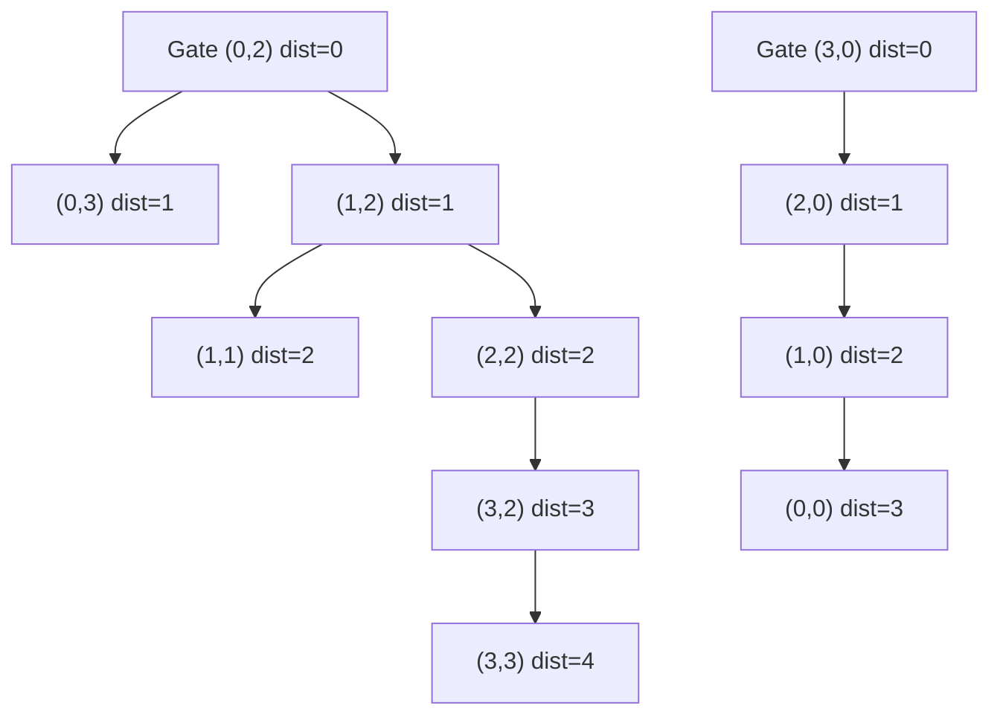

# 86. Walls and Gates

## Problem

You are given a grid where each cell is one of: `-1` (a wall), `0` (a gate), or `2147483647` (an empty room). Fill each empty room with the distance to its nearest gate. If a room cannot reach any gate, leave it as `2147483647`.

## Example 1

### Input

```text
rooms = [
  [2147483647,-1,0,2147483647],
  [2147483647,2147483647,2147483647,-1],
  [2147483647,-1,2147483647,-1],
  [0,-1,2147483647,2147483647]
]
```

### Expected Output

```text
[
  [3,-1,0,1],
  [2,2,1,-1],
  [1,-1,2,-1],
  [0,-1,3,4]
]
```

### Explanation

Each empty room is filled with its shortest distance (steps through non-wall cells) to the nearest gate.

## Example 2

### Input

```text
rooms = [[0,-1],[2147483647,2147483647]]
```

### Expected Output

```text
[[0,-1],[1,2]]
```

### Explanation

The only gate is at (0,0); distances are computed outward from it, stepping around the wall.

## How to Solve

### Key Idea

Just like Rotting Oranges, run a multi-source BFS — but start from every gate at once, since BFS naturally finds shortest distances level by level.

### Approach

1. Add every gate's coordinates to a queue as BFS starting points (distance 0).
2. Run BFS: for each cell popped, look at its neighbors; if a neighbor is an empty room (still at max int), set its distance to current distance + 1 and add it to the queue.
3. Continue until the queue is empty; all reachable rooms will now hold their shortest distance to a gate.

### Why It Works

BFS explores cells in order of increasing distance, so the first time a room is reached, it's guaranteed to be via the shortest path from some gate.

## Visual Explanation



## Optimal Solution

```python
from collections import deque

class Solution:
    def wallsAndGates(self, rooms: list[list[int]]) -> None:
        if not rooms:
            return

        rows, cols = len(rooms), len(rooms[0])
        EMPTY = 2147483647
        queue = deque()

        for r in range(rows):
            for c in range(cols):
                if rooms[r][c] == 0:
                    queue.append((r, c))

        directions = [(1,0),(-1,0),(0,1),(0,-1)]

        while queue:
            r, c = queue.popleft()
            for dr, dc in directions:
                nr, nc = r + dr, c + dc
                if (0 <= nr < rows and 0 <= nc < cols and
                        rooms[nr][nc] == EMPTY):
                    rooms[nr][nc] = rooms[r][c] + 1
                    queue.append((nr, nc))
```

## Complexity

- **Time:** O(rows * cols)
- **Space:** O(rows * cols)

## Real-World Uses

- Computing nearest emergency exit or fire escape distance in building evacuation planning.
- Finding the nearest hospital, warehouse, or service point from every location on a map.
- Signal/heat propagation distance calculations from multiple fixed sources in a grid simulation.

## Key Takeaway

Multi-source BFS is the go-to technique whenever you need the shortest distance from any of several starting points to every other cell.
