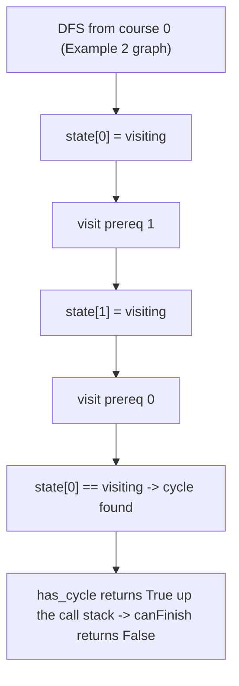

# 87. Course Schedule

## Problem

There are `numCourses` courses labeled `0` to `numCourses - 1`. You are given a list of prerequisite pairs `[a, b]` meaning you must take course `b` before course `a`. Return `True` if it's possible to finish all courses, or `False` if there's a cycle that makes it impossible.

## Example 1

### Input

```text
numCourses = 2, prerequisites = [[1,0]]
```

### Expected Output

```text
True
```

### Explanation

Take course 0 first, then course 1. No cycle exists.

## Example 2

### Input

```text
numCourses = 2, prerequisites = [[1,0],[0,1]]
```

### Expected Output

```text
False
```

### Explanation

Course 0 needs course 1, and course 1 needs course 0 — a cycle, so it's impossible to finish both.

## How to Solve

### Key Idea

This is really "does this directed graph have a cycle?" If it does, the courses can't all be finished; if not, they can.

### Approach

1. Build an adjacency list: for each course, list which courses it depends on.
2. Use DFS with three states per node (unvisited, visiting, visited) to detect cycles: if you revisit a node that's currently "visiting" (on the current DFS path), there's a cycle.
3. Run DFS from every course; if no cycle is found anywhere, return True, otherwise return False.

### Why It Works

A cycle in the prerequisite graph means a course indirectly depends on itself, which can never be satisfied. Tracking "currently in progress" nodes during DFS is the standard way to catch that.

## Visual Explanation



## Optimal Solution

```python
class Solution:
    def canFinish(self, numCourses: int, prerequisites: list[list[int]]) -> bool:
        graph = [[] for _ in range(numCourses)]
        for course, prereq in prerequisites:
            graph[course].append(prereq)

        # 0 = unvisited, 1 = visiting, 2 = fully visited
        state = [0] * numCourses

        def has_cycle(course):
            if state[course] == 1:
                return True
            if state[course] == 2:
                return False

            state[course] = 1
            for prereq in graph[course]:
                if has_cycle(prereq):
                    return True
            state[course] = 2
            return False

        for course in range(numCourses):
            if has_cycle(course):
                return False

        return True
```

## Complexity

- **Time:** O(V + E), where V is courses and E is prerequisite pairs
- **Space:** O(V + E)

## Real-World Uses

- Detecting circular dependencies in build systems or package managers (e.g. npm, pip).
- Validating that a spreadsheet's formula dependencies don't form an infinite loop.
- Checking feasibility of a project's task dependency graph before scheduling work.

## Key Takeaway

"Can all tasks be completed given dependencies" is a cycle-detection problem on a directed graph — DFS with a visiting/visited state array is the classic tool for this.
