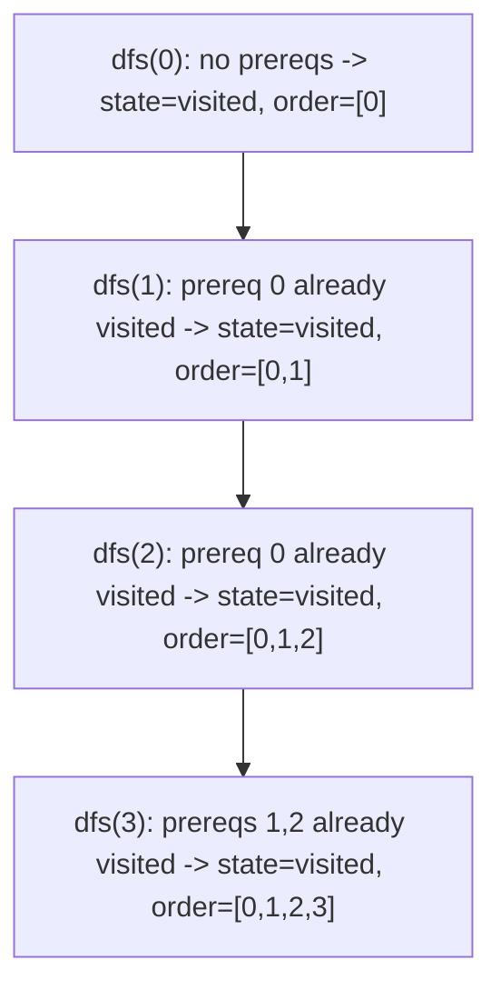

# 88. Course Schedule II

## Problem

There are `numCourses` courses labeled `0` to `numCourses - 1`, and a list of prerequisite pairs `[a, b]` meaning course `b` must be taken before course `a`. Return a valid order to take all the courses. If it's impossible (there's a cycle), return an empty array.

## Example 1

### Input

```text
numCourses = 4, prerequisites = [[1,0],[2,0],[3,1],[3,2]]
```

### Expected Output

```text
[0,1,2,3]
```

### Explanation

Course 0 has no prerequisites, so it comes first. Courses 1 and 2 depend only on 0. Course 3 depends on both 1 and 2, so it comes last.

## Example 2

### Input

```text
numCourses = 2, prerequisites = [[1,0],[0,1]]
```

### Expected Output

```text
[]
```

### Explanation

Course 0 needs course 1 and course 1 needs course 0 — a cycle — so no valid order exists.

## How to Solve

### Key Idea

This is a topological sort of the prerequisite graph. If the graph has a cycle, no topological order exists.

### Approach

1. Build an adjacency list of each course's prerequisites (or dependents, depending on direction chosen).
2. Use DFS with three states (unvisited, visiting, visited) to detect cycles, and append each course to a result list right after all its prerequisites have been fully processed (post-order).
3. If a cycle is detected, return an empty list. Otherwise, since courses are appended after their dependencies, reverse the result to get a valid order (or build it directly in the right order depending on graph direction used).

### Why It Works

Post-order DFS guarantees a node is added to the output only after everything it depends on has already been added, which is exactly the definition of a valid topological order.

## Visual Explanation



## Optimal Solution

```python
class Solution:
    def findOrder(self, numCourses: int, prerequisites: list[list[int]]) -> list[int]:
        graph = [[] for _ in range(numCourses)]
        for course, prereq in prerequisites:
            graph[course].append(prereq)

        # 0 = unvisited, 1 = visiting, 2 = fully visited
        state = [0] * numCourses
        order = []

        def dfs(course):
            if state[course] == 1:
                return False  # cycle detected
            if state[course] == 2:
                return True

            state[course] = 1
            for prereq in graph[course]:
                if not dfs(prereq):
                    return False
            state[course] = 2
            order.append(course)
            return True

        for course in range(numCourses):
            if not dfs(course):
                return []

        return order
```

## Complexity

- **Time:** O(V + E), where V is courses and E is prerequisite pairs
- **Space:** O(V + E)

## Real-World Uses

- Resolving build order for compiling modules with interdependencies.
- Scheduling tasks in a project plan where some tasks must precede others.
- Determining installation order for software packages based on dependency graphs.

## Key Takeaway

Whenever you need a valid ordering that respects dependencies, think topological sort: DFS post-order (or Kahn's BFS algorithm) both work, and cycle detection tells you when no valid order exists.
