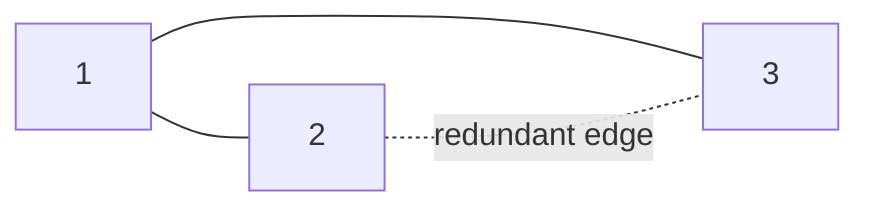

# 91. Redundant Connection

## Problem

You are given a graph that started as a tree with `n` nodes, but one extra edge was added, creating exactly one cycle. The edges are given in the order they were added. Return the edge that, if removed, would restore the graph to a valid tree. If multiple such edges exist, return the last one in the input.

## Example 1

### Input

```text
edges = [[1,2],[1,3],[2,3]]
```

### Expected Output

```text
[2,3]
```

### Explanation

Nodes 1, 2, 3 already formed a tree after the first two edges. The edge [2,3] creates a cycle, so it's the redundant one.

## Example 2

### Input

```text
edges = [[1,2],[2,3],[3,4],[1,4],[1,5]]
```

### Expected Output

```text
[1,4]
```

### Explanation

Edges [1,2],[2,3],[3,4] form a chain, and [1,4] connects back to node 1 already reachable, creating a cycle.

## How to Solve

### Key Idea

Process edges in order using Union-Find. The first edge that tries to connect two nodes already in the same group is the redundant one, since it's the one creating a cycle.

### Approach

1. Initialize Union-Find with each node as its own parent.
2. For each edge `[a, b]` in order, check if `a` and `b` are already connected (same root).
3. If they are, this edge is the answer — return it immediately. Otherwise, union them and continue.

### Why It Works

Since the original structure was a tree plus exactly one extra edge, the first edge encountered that connects two already-connected nodes must be the one causing the cycle, and processing in input order guarantees it's also the last such edge if ties existed.

## Visual Explanation



## Optimal Solution

```python
class Solution:
    def findRedundantConnection(self, edges: list[list[int]]) -> list[int]:
        n = len(edges)
        parent = list(range(n + 1))
        rank = [1] * (n + 1)

        def find(x):
            while parent[x] != x:
                parent[x] = parent[parent[x]]
                x = parent[x]
            return x

        def union(x, y):
            root_x, root_y = find(x), find(y)
            if root_x == root_y:
                return False  # already connected -> cycle

            if rank[root_x] < rank[root_y]:
                root_x, root_y = root_y, root_x
            parent[root_y] = root_x
            rank[root_x] += rank[root_y]
            return True

        for a, b in edges:
            if not union(a, b):
                return [a, b]

        return []
```

## Complexity

- **Time:** O(n * α(n)), effectively O(n)
- **Space:** O(n)

## Real-World Uses

- Finding the extra cable/link in a network that creates an unwanted loop.
- Detecting the specific redundant dependency edge causing a cycle in a dependency graph.
- Auditing circuit diagrams to locate the connection that introduces a short-circuit loop.

## Key Takeaway

Union-Find shines whenever you need to detect the exact edge that first creates a cycle while building a graph incrementally.
