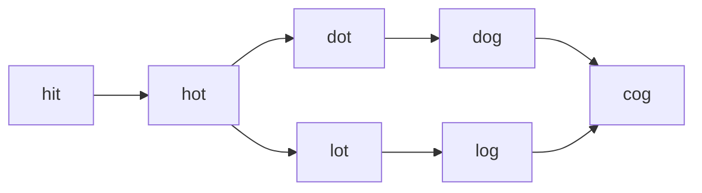

# 92. Word Ladder

## Problem

You are given a `beginWord`, an `endWord`, and a `wordList` of valid words. Find the length of the shortest transformation sequence from `beginWord` to `endWord`, changing exactly one letter at a time, where every intermediate word must exist in `wordList`. Return 0 if no such sequence exists.

## Example 1

### Input

```text
beginWord = "hit", endWord = "cog", wordList = ["hot","dot","dog","lot","log","cog"]
```

### Expected Output

```text
5
```

### Explanation

One shortest path is "hit" -> "hot" -> "dot" -> "dog" -> "cog", which has 5 words total.

## Example 2

### Input

```text
beginWord = "hit", endWord = "cog", wordList = ["hot","dot","dog","lot","log"]
```

### Expected Output

```text
0
```

### Explanation

"cog" is not in the word list, so it's impossible to reach it.

## How to Solve

### Key Idea

Think of each word as a node in a graph, with an edge between two words if they differ by exactly one letter. Then the shortest transformation sequence is just the shortest path in this graph, found with BFS.

### Approach

1. Put all words from `wordList` into a set for fast lookup, and confirm `endWord` is in the set (otherwise return 0 immediately).
2. Run BFS starting from `beginWord`: for each word, try changing each letter position to every other letter of the alphabet, and if the result is in the word set, it's a valid neighbor.
3. Track the BFS depth (number of transformations); when you reach `endWord`, return the depth + 1 (word count). Remove visited words from the set so they aren't revisited.

### Why It Works

BFS explores all sequences of length k before any sequence of length k+1, so the first time `endWord` is reached, it's guaranteed to be via the shortest possible transformation sequence.

## Visual Explanation



## Optimal Solution

```python
from collections import deque

class Solution:
    def ladderLength(self, beginWord: str, endWord: str, wordList: list[str]) -> int:
        word_set = set(wordList)
        if endWord not in word_set:
            return 0

        queue = deque([(beginWord, 1)])
        word_set.discard(beginWord)

        while queue:
            word, steps = queue.popleft()
            if word == endWord:
                return steps

            for i in range(len(word)):
                for c in "abcdefghijklmnopqrstuvwxyz":
                    if c == word[i]:
                        continue
                    next_word = word[:i] + c + word[i + 1:]
                    if next_word in word_set:
                        word_set.remove(next_word)
                        queue.append((next_word, steps + 1))

        return 0
```

## Complexity

- **Time:** O(M^2 * N), where M is word length and N is the number of words in the list
- **Space:** O(M * N)

## Real-World Uses

- Finding shortest transformation paths in spell-checkers or DNA sequence mutation analysis.
- Shortest-path search in maps/navigation apps modeled as state graphs.
- Finding the shortest chain of connections between two people in a social network (degrees of separation).

## Key Takeaway

When a problem involves transforming one state into another through a series of valid single-step changes, model it as a graph and use BFS to find the shortest path.
