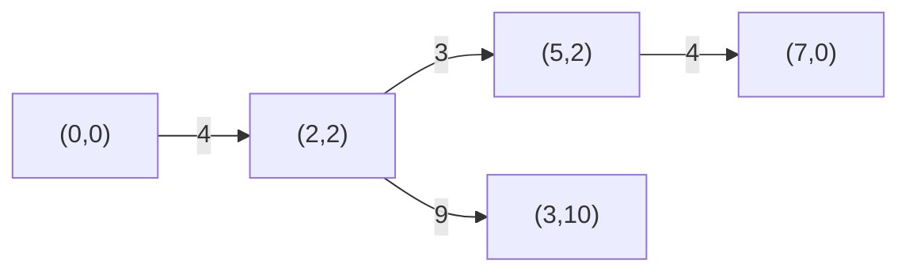

# 94. Min Cost to Connect All Points

## Problem

You are given an array of points on a 2D plane. The cost to connect two points is the Manhattan distance between them: `|x1 - x2| + |y1 - y2|`. Find the minimum total cost to connect all points so that there is a path between every pair of points (directly or through other points).

## Example 1

### Input

```text
points = [[0,0],[2,2],[3,10],[5,2],[7,0]]
```

### Expected Output

```text
20
```

### Explanation

Connecting the points using the cheapest set of edges (a minimum spanning tree) costs 20 in total.

## Example 2

### Input

```text
points = [[3,12],[-2,5],[-4,1]]
```

### Expected Output

```text
18
```

### Explanation

The cheapest way to connect all 3 points: (-2,5)-(-4,1) costs 6, and (-2,5)-(3,12) costs 12, total 18.

## How to Solve

### Key Idea

This is a Minimum Spanning Tree (MST) problem: treat every point as a node and every pair of points as a potential edge weighted by Manhattan distance, then find the cheapest set of edges connecting all nodes with no cycles. Prim's algorithm works great here.

### Approach

1. Pick a starting point and mark it as "in the tree."
2. Keep a min-heap of edges (cost, point) connecting the tree to points not yet in the tree.
3. Repeatedly pop the cheapest edge; if it leads to a point not yet included, add that point to the tree and push all its edges to points still outside.
4. Sum the costs of edges used until every point is included.

### Why It Works

Prim's algorithm greedily grows the tree by always picking the cheapest available edge to a new node. Because it never creates a cycle and only expands the connected set, the total cost is guaranteed to be minimal for connecting all points.

## Visual Explanation



## Optimal Solution

```python
import heapq

class Solution:
    def minCostConnectPoints(self, points: list[list[int]]) -> int:
        n = len(points)
        visited = [False] * n
        min_heap = [(0, 0)]  # (cost, point index)
        total_cost = 0
        edges_used = 0

        while min_heap and edges_used < n:
            cost, i = heapq.heappop(min_heap)
            if visited[i]:
                continue
            visited[i] = True
            total_cost += cost
            edges_used += 1

            x1, y1 = points[i]
            for j in range(n):
                if not visited[j]:
                    x2, y2 = points[j]
                    dist = abs(x1 - x2) + abs(y1 - y2)
                    heapq.heappush(min_heap, (dist, j))

        return total_cost
```

## Complexity

- **Time:** O(n^2 log n), since we may push O(n) edges per node into the heap
- **Space:** O(n) for the heap and visited array

## Real-World Uses

- Designing cost-efficient network infrastructure, such as laying cable or fiber to connect facilities.
- Planning road or utility networks that link cities or sites with minimal total construction cost.
- Clustering algorithms that build a minimum spanning tree to group similar data points.

## Key Takeaway

Whenever you need to connect all nodes with minimum total edge weight and no cycles, that's a Minimum Spanning Tree problem — Prim's algorithm with a min-heap is a reliable go-to.
