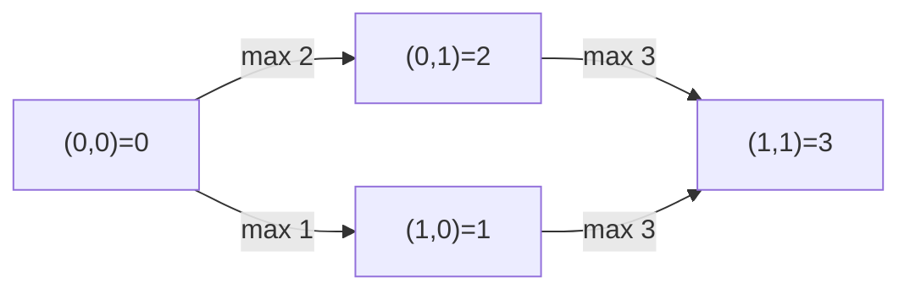

# 96. Swim in Rising Water

## Problem

You are given an `n x n` grid where `grid[i][j]` is the elevation at that cell. Water rises over time, and at time `t` you may only move to a cell whose elevation is `<= t`. You start at the top-left cell at time 0 and want to reach the bottom-right cell. Moves are up/down/left/right. Find the minimum time `t` at which this is possible.

## Example 1

### Input

```text
grid = [[0,2],[1,3]]
```

### Expected Output

```text
3
```

### Explanation

At time 3, all cells (elevations 0,2,1,3) are usable, letting you reach the bottom-right; time 3 is the first moment a full path exists.

## Example 2

### Input

```text
grid = [[0,1,2,3,4],[24,23,22,21,5],[12,13,14,15,16],[11,17,18,19,20],[10,9,8,7,6]]
```

### Expected Output

```text
16
```

### Explanation

The snake-like path through elevations 0..16 lets you reach the bottom-right once the water level reaches 16, which is the minimum needed.

## How to Solve

### Key Idea

We need the smallest time `t` such that a path exists using only cells with elevation `<= t`. This is best solved with a Dijkstra-style approach: always expand toward the neighbor that requires the least additional elevation, tracking the max elevation seen so far on each path.

### Approach

1. Use a min-heap starting with `(grid[0][0], 0, 0)` representing (max elevation on path so far, row, col).
2. Pop the cell with smallest "path max so far," and if it's the bottom-right cell, return that value.
3. For each unvisited neighbor, push `(max(current_max, neighbor_elevation), neighbor_row, neighbor_col)`.
4. Mark cells visited once popped to avoid reprocessing.

### Why It Works

This is Dijkstra's algorithm where the "distance" of a path is the maximum elevation encountered along it, not the sum. Since we always expand the path with the smallest current max elevation first, the first time we pop the destination cell, that value is guaranteed minimal.

## Visual Explanation



## Optimal Solution

```python
import heapq

class Solution:
    def swimInWater(self, grid: list[list[int]]) -> int:
        n = len(grid)
        visited = [[False] * n for _ in range(n)]
        min_heap = [(grid[0][0], 0, 0)]
        visited[0][0] = True
        directions = [(0, 1), (0, -1), (1, 0), (-1, 0)]

        while min_heap:
            max_elevation, r, c = heapq.heappop(min_heap)
            if r == n - 1 and c == n - 1:
                return max_elevation

            for dr, dc in directions:
                nr, nc = r + dr, c + dc
                if 0 <= nr < n and 0 <= nc < n and not visited[nr][nc]:
                    visited[nr][nc] = True
                    new_max = max(max_elevation, grid[nr][nc])
                    heapq.heappush(min_heap, (new_max, nr, nc))

        return -1
```

## Complexity

- **Time:** O(n^2 log n), since each of the n^2 cells is pushed/popped from the heap
- **Space:** O(n^2) for the visited grid and heap

## Real-World Uses

- Flood risk planning, determining the minimum water level at which a route becomes impassable or passable.
- Terrain-aware routing for vehicles or hikers where the limiting factor is the highest obstacle encountered, not total distance.
- Network bandwidth planning where a path's capacity is limited by its weakest (or in this case, highest-cost) link.

## Key Takeaway

When a path's "cost" is the maximum value along it rather than a sum, you can still use Dijkstra's algorithm — just redefine how you combine costs when relaxing edges.
