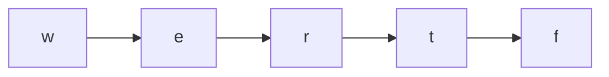

# 97. Alien Dictionary

## Problem

You are given a list of words from an alien language, sorted according to that language's unknown alphabet rules. Figure out a valid ordering of the letters in that alphabet. If no valid ordering exists (the input is contradictory), return an empty string.

## Example 1

### Input

```text
words = ["wrt","wrf","er","ett","rftt"]
```

### Expected Output

```text
"wertf"
```

### Explanation

Comparing adjacent words gives ordering clues: w before e, r before t, e before r, t before f, giving one valid full order "wertf".

## Example 2

### Input

```text
words = ["z","x","z"]
```

### Expected Output

```text
""
```

### Explanation

From "z" -> "x" we learn z comes before x, but from "x" -> "z" we'd need x before z, which is a contradiction, so no valid order exists.

## How to Solve

### Key Idea

Compare each pair of adjacent words to find the first differing letters — that tells you one character must come before another. This builds a directed graph of letter ordering constraints, and a topological sort of that graph gives a valid alphabet order.

### Approach

1. Collect every unique character across all words as graph nodes.
2. For each pair of adjacent words, find the first position where they differ and add a directed edge from the earlier word's letter to the later word's letter. Also check the edge case where a word is a prefix of an earlier word incorrectly (e.g., `["abc", "ab"]`) — that's invalid, return "".
3. Run a topological sort (BFS with in-degree counting, i.e. Kahn's algorithm) on this letter graph.
4. If the sort includes all letters, return the order as a string; if a cycle prevents including all letters, return "".

### Why It Works

Topological sort produces an ordering of nodes where every directed edge points from an earlier node to a later one. Since each edge represents "this letter must come before that letter," a valid topological order is exactly a valid alien alphabet order — and a cycle means the constraints are contradictory, so no order exists.

## Visual Explanation



## Optimal Solution

```python
from collections import defaultdict, deque

class Solution:
    def alienOrder(self, words: list[str]) -> str:
        adjacency = defaultdict(set)
        in_degree = {c: 0 for word in words for c in word}

        for first, second in zip(words, words[1:]):
            min_len = min(len(first), len(second))
            if len(first) > len(second) and first[:min_len] == second[:min_len]:
                return ""  # invalid: longer word is "before" its own prefix
            for c1, c2 in zip(first, second):
                if c1 != c2:
                    if c2 not in adjacency[c1]:
                        adjacency[c1].add(c2)
                        in_degree[c2] += 1
                    break

        queue = deque([c for c in in_degree if in_degree[c] == 0])
        order = []

        while queue:
            c = queue.popleft()
            order.append(c)
            for neighbor in adjacency[c]:
                in_degree[neighbor] -= 1
                if in_degree[neighbor] == 0:
                    queue.append(neighbor)

        if len(order) != len(in_degree):
            return ""  # cycle detected
        return "".join(order)
```

## Complexity

- **Time:** O(C), where C is the total number of characters across all words
- **Space:** O(1) extra beyond the graph, bounded by the alphabet size (at most 26 letters)

## Real-World Uses

- Build systems resolving dependency order so packages or modules compile in a valid sequence.
- Course scheduling systems determining a valid order to take classes given prerequisite constraints.
- Task schedulers in project management tools that order steps based on partial ordering constraints.

## Key Takeaway

Whenever ordering rules come from pairwise comparisons, build a directed graph of "comes before" constraints and run a topological sort — this pattern shows up anywhere you need to derive a global order from partial local clues.
