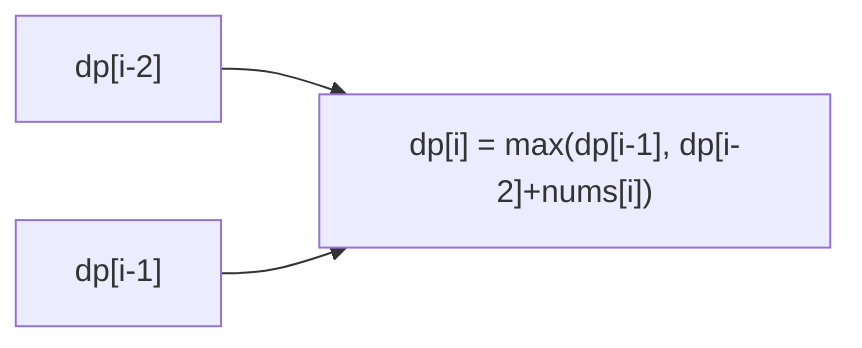

# 101. House Robber

## Problem

You are a robber planning to rob houses along a street. Each house has some amount of money, given in an array `nums`. You cannot rob two adjacent houses (it triggers an alarm). Find the maximum amount of money you can rob.

## Example 1

### Input

```text
nums = [1, 2, 3, 1]
```

### Expected Output

```text
4
```

### Explanation

Rob house 0 (1) and house 2 (3) for a total of 4.

## Example 2

### Input

```text
nums = [2, 7, 9, 3, 1]
```

### Expected Output

```text
12
```

### Explanation

Rob house 0 (2), house 2 (9), and house 4 (1) for a total of 12.

## How to Solve

### Key Idea

For each house, you either skip it (keep the best total so far) or rob it (its value plus the best total from two houses back). Track the running best.

### Approach

1. Keep two variables representing the max money obtainable up to the previous house and the one before that.
2. For each house, decide the best of "skip this house" vs "rob this house + best from two houses back".
3. Slide the two variables forward through the array.
4. Return the final "best up to last house" value.

### Why It Works

Because you can't rob two adjacent houses, the best result at house `i` only depends on the best results at houses `i-1` and `i-2`. This overlapping subproblem structure is what makes DP work here.

## Visual Explanation



## Optimal Solution

```python
class Solution:
    def rob(self, nums: list[int]) -> int:
        rob_prev, rob_prev_prev = 0, 0
        for num in nums:
            rob_prev, rob_prev_prev = max(rob_prev_prev + num, rob_prev), rob_prev
        return rob_prev
```

## Complexity

- **Time:** O(n)
- **Space:** O(1)

## Real-World Uses

- Selecting non-adjacent time slots or shifts to maximize scheduled value without overlap.
- Choosing non-adjacent ad slots or billboard spaces to maximize revenue under spacing rules.
- Optimizing non-adjacent resource extraction (e.g., mining/harvesting plots) under a no-neighbor constraint.

## Key Takeaway

"Take it or skip it, but not two in a row" is a common DP shape — always keep the best score assuming you stopped one step back and two steps back.
