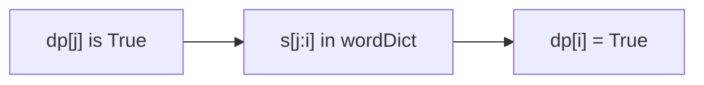

# 108. Word Break

## Problem

Given a string `s` and a list of words `wordDict`, determine if `s` can be split into a sequence of one or more dictionary words. The same word from the dictionary can be reused as many times as needed.

## Example 1

### Input

```text
s = "leetcode", wordDict = ["leet", "code"]
```

### Expected Output

```text
true
```

### Explanation

"leetcode" can be split into "leet" + "code", both of which are in the dictionary.

## Example 2

### Input

```text
s = "catsandog", wordDict = ["cats", "dog", "sand", "and", "cat"]
```

### Expected Output

```text
false
```

### Explanation

No combination of dictionary words can exactly form "catsandog".

## How to Solve

### Key Idea

A prefix of the string up to position `i` can be broken into dictionary words if there's some earlier valid breakpoint `j` such that everything before `j` is breakable, and the piece from `j` to `i` is itself a dictionary word.

### Approach

1. Create a boolean array `dp` of size `len(s) + 1`, where `dp[i]` means "the first `i` characters of `s` can be segmented." Set `dp[0] = True` (empty prefix is trivially valid).
2. For each ending position `i` from 1 to `len(s)`, check every possible starting position `j` before it.
3. If `dp[j]` is true and the substring `s[j:i]` is in the dictionary, set `dp[i] = True` and stop checking further `j` for this `i`.
4. The answer is `dp[len(s)]`.

### Why It Works

Any valid segmentation of the whole string has some final word. If everything before that final word is already known to be segmentable, and the final word itself is in the dictionary, the whole string is segmentable. Checking all possible "last word" boundaries covers every valid segmentation.

## Visual Explanation



## Optimal Solution

```python
class Solution:
    def wordBreak(self, s: str, wordDict: list[str]) -> bool:
        word_set = set(wordDict)
        n = len(s)
        dp = [False] * (n + 1)
        dp[0] = True

        for i in range(1, n + 1):
            for j in range(i):
                if dp[j] and s[j:i] in word_set:
                    dp[i] = True
                    break

        return dp[n]
```

## Complexity

- **Time:** O(n^2) (ignoring substring hashing cost)
- **Space:** O(n)

## Real-World Uses

- Tokenizing text without spaces into valid dictionary words (e.g., search query segmentation).
- Powering autocomplete/search suggestion engines that validate composable input.
- Validating whether a compound identifier (e.g., URL slug) breaks into known keyword segments.

## Key Takeaway

"Can this prefix be built from valid pieces?" is a common DP question — build up answers for shorter prefixes first, then check every way to extend them by one valid piece.
