# 122. Maximum Subarray

## Problem

You are given an array of integers. Find the contiguous subarray (containing at least one number) that has the largest sum, and return that sum. The array can contain negative numbers.

## Example 1

### Input

```text
nums = [-2,1,-3,4,-1,2,1,-5,4]
```

### Expected Output

```text
6
```

### Explanation

The subarray [4,-1,2,1] has the largest sum, which is 6.

## Example 2

### Input

```text
nums = [1]
```

### Expected Output

```text
1
```

### Explanation

There is only one element, so the answer is that element itself.

## How to Solve

### Key Idea

Keep a running sum as you walk through the array. If the running sum ever becomes negative, it can only drag down future sums, so drop it and start fresh from the current number.

### Approach

1. Start with `curSum = 0` and `maxSum = nums[0]`.
2. For each number, add it to `curSum`. If `curSum` becomes negative, reset it to 0.
3. After updating `curSum`, compare it to `maxSum` and keep the larger value.
4. Return `maxSum` at the end.

### Why It Works

A negative running total never helps a future subarray, so throwing it away and restarting is always at least as good as keeping it. This greedy choice at each step leads to the overall best answer, which is the idea behind Kadane's Algorithm.

## Visual Explanation

```mermaid
flowchart LR
    A["-2 -> cur=-2, max=-2"] --> B["1 -> reset, cur=1, max=1"]
    B --> C["-3 -> cur=-2, max=1"]
    C --> D["4 -> reset, cur=4, max=4"]
    D --> E["-1 -> cur=3, max=4"]
    E --> F["2 -> cur=5, max=5"]
    F --> G["1 -> cur=6, max=6"]
    G --> H["-5 -> cur=1, max=6"]
    H --> I["4 -> cur=5, max=6"]
```



## Optimal Solution

```python
class Solution:
    def maxSubArray(self, nums: list[int]) -> int:
        max_sum = nums[0]
        cur_sum = 0

        for num in nums:
            if cur_sum < 0:
                cur_sum = 0
            cur_sum += num
            max_sum = max(max_sum, cur_sum)

        return max_sum
```

## Complexity

- **Time:** O(n)
- **Space:** O(1)

## Real-World Uses

- Spotting the best-performing stretch of days in a stock price or revenue time series.
- Identifying the strongest streak of positive engagement in analytics data (e.g. sensor readings, user activity logs).
- Detecting the highest-scoring contiguous segment in signal processing or bioinformatics data.

## Key Takeaway

This is the classic Kadane's Algorithm: track a running sum and reset it to zero whenever it goes negative. It's a great first example of a greedy, single-pass solution.
