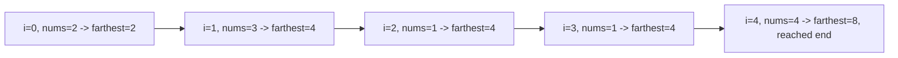

# 123. Jump Game

## Problem

You start at index 0 of an array where each value tells you the maximum number of steps you can jump forward from that position. Determine whether you can reach the last index of the array.

## Example 1

### Input

```text
nums = [2,3,1,1,4]
```

### Expected Output

```text
true
```

### Explanation

Jump 1 step from index 0 to 1, then 3 steps to the last index.

## Example 2

### Input

```text
nums = [3,2,1,0,4]
```

### Expected Output

```text
false
```

### Explanation

You always land on index 3, where the value is 0, so you get stuck and can never reach index 4.

## How to Solve

### Key Idea

Track the farthest index you can currently reach. If you ever reach a position beyond what is currently reachable before finishing your scan, you're stuck.

### Approach

1. Keep a variable `farthest` starting at 0, representing the furthest index reachable so far.
2. Loop through the array by index `i`.
3. If `i` is greater than `farthest`, you can't get here, so return false.
4. Otherwise update `farthest = max(farthest, i + nums[i])`.
5. If the loop finishes, return true.

### Why It Works

We only care about the best possible reach at each step. Greedily keeping the maximum reachable index is enough information to decide reachability — you never need to know exactly which path got you there.

## Visual Explanation



## Optimal Solution

```python
class Solution:
    def canJump(self, nums: list[int]) -> bool:
        farthest = 0

        for i, num in enumerate(nums):
            if i > farthest:
                return False
            farthest = max(farthest, i + num)

        return True
```

## Complexity

- **Time:** O(n)
- **Space:** O(1)

## Real-World Uses

- Checking reachability in game level design, e.g. can a player get from the start to the goal given movement rules.
- Validating whether a robot or drone with limited movement range can traverse a planned path.
- Analyzing network or supply chain reachability where each node has a maximum forward "hop" capacity.

## Key Takeaway

Many "can I reach the end" problems reduce to tracking the farthest reachable point greedily, in one linear pass, without needing to explore every path.
