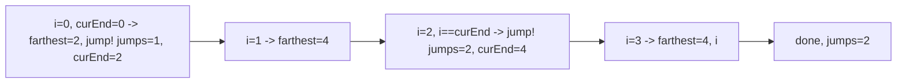

# 124. Jump Game II

## Problem

You start at index 0 of an array where each value is the maximum number of steps you can jump forward from that position. You are guaranteed you can reach the last index. Find the minimum number of jumps needed to get there.

## Example 1

### Input

```text
nums = [2,3,1,1,4]
```

### Expected Output

```text
2
```

### Explanation

Jump 1 step from index 0 to index 1, then 3 steps to the last index.

## Example 2

### Input

```text
nums = [2,3,0,1,4]
```

### Expected Output

```text
2
```

### Explanation

Jump 2 steps from index 0 to index 2, then 2 steps to the last index.

## How to Solve

### Key Idea

Think in terms of "jump levels": from your current jump, there's a range of indices you can reach. Explore that whole range, track the farthest you could go on the next jump, and only increase the jump count when you must move into a new range.

### Approach

1. Keep `jumps = 0`, `curEnd = 0` (end of range reachable with current number of jumps), and `farthest = 0`.
2. Loop through indices from 0 to second-to-last.
3. Update `farthest = max(farthest, i + nums[i])`.
4. If `i` reaches `curEnd`, you must take another jump: increment `jumps`, set `curEnd = farthest`.
5. Return `jumps`.

### Why It Works

Each "level" represents everywhere reachable using the same number of jumps. By greedily expanding `farthest` while scanning a level, you guarantee the next jump takes you as far as possible, which minimizes the total jumps.

## Visual Explanation



## Optimal Solution

```python
class Solution:
    def jump(self, nums: list[int]) -> int:
        jumps = 0
        cur_end = 0
        farthest = 0

        for i in range(len(nums) - 1):
            farthest = max(farthest, i + nums[i])
            if i == cur_end:
                jumps += 1
                cur_end = farthest

        return jumps
```

## Complexity

- **Time:** O(n)
- **Space:** O(1)

## Real-World Uses

- Computing the minimum number of transfers or hops in a routing/network problem with limited range per hop.
- Planning the fewest legs in a travel itinerary where each stop has a maximum onward range.
- Minimizing the number of moves in strategy games where each turn has a variable movement radius.

## Key Takeaway

Processing the array in "reachable levels" and greedily tracking the farthest point in each level is a powerful pattern for minimum-step reachability problems.
