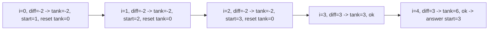

# 125. Gas Station

## Problem

There are gas stations arranged in a circle. Each station `i` has `gas[i]` fuel available and it costs `cost[i]` fuel to drive from station `i` to the next station. Your car starts with an empty tank. Find the starting station index from which you can travel around the entire circuit exactly once, or return -1 if it's impossible. If a solution exists, it's guaranteed to be unique.

## Example 1

### Input

```text
gas = [1,2,3,4,5], cost = [3,4,5,1,2]
```

### Expected Output

```text
3
```

### Explanation

Starting at station 3, you have just enough gas at every step to make it all the way around back to station 3.

## Example 2

### Input

```text
gas = [2,3,4], cost = [3,4,3]
```

### Expected Output

```text
-1
```

### Explanation

Total gas (9) is less than total cost (10), so completing the circuit is impossible from any starting point.

## How to Solve

### Key Idea

If the total gas is less than the total cost, no solution exists. Otherwise, whenever your running tank goes negative starting from some index, none of the stations between the old start and the current index can be a valid start either, so jump your candidate start to the next station.

### Approach

1. If `sum(gas) < sum(cost)`, return -1 immediately.
2. Track `total_tank = 0` (running deficit tracker) and `cur_tank = 0` (tank since current candidate start), and `start = 0`.
3. For each station `i`, add `gas[i] - cost[i]` to both `total_tank` and `cur_tank`.
4. If `cur_tank` drops below 0, set `start = i + 1` and reset `cur_tank = 0`.
5. Return `start` (guaranteed valid since total gas >= total cost).

### Why It Works

If you run out of gas while starting from some index, every station in between also fails as a starting point (they'd arrive at the failure point with even less fuel). So you can safely skip straight past all of them to the next index.

## Visual Explanation



## Optimal Solution

```python
class Solution:
    def canCompleteCircuit(self, gas: list[int], cost: list[int]) -> int:
        if sum(gas) < sum(cost):
            return -1

        total_tank = 0
        start = 0

        for i in range(len(gas)):
            diff = gas[i] - cost[i]
            total_tank += diff
            if total_tank < 0:
                start = i + 1
                total_tank = 0

        return start
```

## Complexity

- **Time:** O(n)
- **Space:** O(1)

## Real-World Uses

- Route and fuel planning for delivery trucks or ride-share vehicles with limited fuel/battery capacity.
- Determining a feasible starting point in a circular production or resource-supply schedule.
- Balancing cash flow across a rotating billing cycle to find where a budget never goes negative.

## Key Takeaway

When a running total goes negative, you can safely skip past all the indices that led to the failure — they can never be valid starting points either, letting you solve the whole circuit in one pass.
