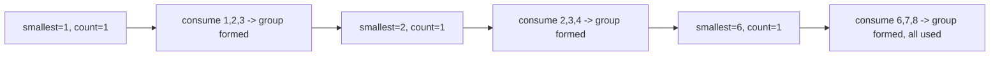

# 126. Hand of Straights

## Problem

You're given a hand of cards as an array of integers and a group size `groupSize`. Determine whether the cards can be rearranged into groups, each of exactly `groupSize` cards with consecutive values (like 3,4,5). Every card must be used in exactly one group.

## Example 1

### Input

```text
hand = [1,2,3,6,2,3,4,7,8], groupSize = 3
```

### Expected Output

```text
true
```

### Explanation

The cards can be split into groups [1,2,3], [2,3,4], and [6,7,8].

## Example 2

### Input

```text
hand = [1,2,3,4,5], groupSize = 4
```

### Expected Output

```text
false
```

### Explanation

There are 5 cards total, which is not evenly divisible by a group size of 4.

## How to Solve

### Key Idea

Always try to build a consecutive run starting from the smallest remaining card value. If that card exists, the run it starts must be completable, or the whole hand can't be arranged.

### Approach

1. If the total number of cards is not divisible by `groupSize`, return false immediately.
2. Count how many of each card value there are.
3. Repeatedly take the smallest value that still has a positive count.
4. Try to remove one copy of that value and the next `groupSize - 1` consecutive values. If any of them is missing, return false.
5. If you use up all cards this way, return true.

### Why It Works

The smallest remaining card must be the start of some group, since no smaller card exists to place before it. Greedily using it as a group's start and consuming the following consecutive values is the only way to place it validly.

## Visual Explanation



## Optimal Solution

```python
from collections import Counter

class Solution:
    def isNStraightHand(self, hand: list[int], groupSize: int) -> bool:
        if len(hand) % groupSize != 0:
            return False

        count = Counter(hand)
        sorted_keys = sorted(count.keys())

        for key in sorted_keys:
            amount_needed = count[key]
            if amount_needed > 0:
                for next_val in range(key, key + groupSize):
                    if count[next_val] < amount_needed:
                        return False
                    count[next_val] -= amount_needed

        return True
```

## Complexity

- **Time:** O(n log n) for sorting the unique values
- **Space:** O(n) for the count map

## Real-World Uses

- Grouping inventory items with sequential IDs or dates into equal-sized batches for shipping or processing.
- Organizing playing cards or tiles in games that require consecutive-run groupings.
- Scheduling consecutive time slots (e.g. shifts, appointment blocks) into fixed-size, evenly spaced groups.

## Key Takeaway

When you need to build consecutive groups, always start from the smallest untouched value — it has no choice but to begin a new group, which makes the greedy choice forced and correct.
