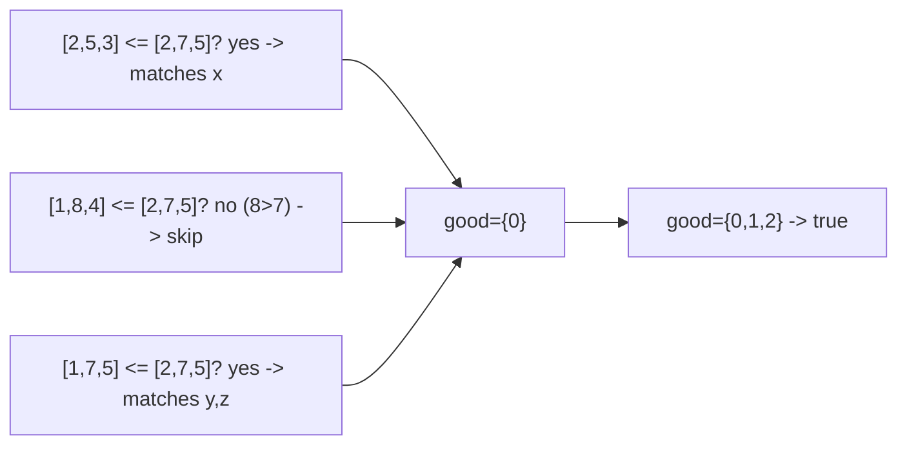

# 127. Merge Triplets to Form Target Triplet

## Problem

You are given a list of triplets and a target triplet, each with 3 values (x, y, z). A "merge" operation takes two triplets and creates a new one where each position holds the maximum of the two triplets at that position. Determine whether you can pick some of the given triplets and merge them (in any order) to produce exactly the target triplet.

## Example 1

### Input

```text
triplets = [[2,5,3],[1,8,4],[1,7,5]], target = [2,7,5]
```

### Expected Output

```text
true
```

### Explanation

Merge triplets [2,5,3] and [1,7,5] to get [max(2,1), max(5,7), max(3,5)] = [2,7,5].

## Example 2

### Input

```text
triplets = [[3,4,5],[4,5,6]], target = [3,2,5]
```

### Expected Output

```text
false
```

### Explanation

Every triplet has a value at index 1 that is greater than 2, and merging can only keep or increase values, so it's impossible to bring index 1 down to 2.

## How to Solve

### Key Idea

Only triplets where no coordinate exceeds the matching target coordinate are usable — anything else would push a merged value above target. Among the usable triplets, check whether each target coordinate is achieved by at least one of them.

### Approach

1. For each triplet, check if all three of its values are less than or equal to the corresponding target values. If any value is too big, skip this triplet (it can never be used).
2. For the valid triplets, track which target coordinates (x, y, z) have been matched exactly by at least one valid triplet.
3. If all three coordinates get matched by some valid triplet, return true, else false.

### Why It Works

Merging only takes maximums, so a triplet with any coordinate greater than target's would corrupt any merge. Filtering those out leaves only "safe" triplets. Since merge takes the max, and safe triplets never exceed target, achieving each coordinate exactly once among safe triplets is both necessary and sufficient.

## Visual Explanation



## Optimal Solution

```python
class Solution:
    def mergeTriplets(self, triplets: list[list[int]], target: list[int]) -> bool:
        good = set()

        for t in triplets:
            if t[0] > target[0] or t[1] > target[1] or t[2] > target[2]:
                continue
            for i in range(3):
                if t[i] == target[i]:
                    good.add(i)

        return len(good) == 3
```

## Complexity

- **Time:** O(n)
- **Space:** O(1)

## Real-World Uses

- Combining sensor readings or config overrides where merging takes the maximum of each field, and you need to confirm a target profile is achievable.
- Validating whether a set of permission grants (each capped at certain levels) can be combined to exactly match a required access profile.
- Checking feasibility of achieving target specifications by combining component upgrades that only ever increase individual metrics.

## Key Takeaway

When an operation can only increase values (like taking a max), discard any candidate that already overshoots the target, then greedily check that every target coordinate is still reachable from what remains.
