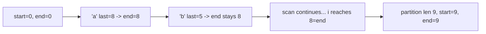

# 128. Partition Labels

## Problem

You are given a string. Split it into as many parts as possible so that each letter appears in only one part (a letter can't be split across two parts). Return the length of each part, in order.

## Example 1

### Input

```text
s = "ababcbacadefegdehijhklij"
```

### Expected Output

```text
[9,7,8]
```

### Explanation

The string splits into "ababcbaca", "defegde", "hijhklij" — each letter only appears within one of these parts.

## Example 2

### Input

```text
s = "eccbbbbdec"
```

### Expected Output

```text
[10]
```

### Explanation

The letter 'e' appears at both the start and near the end, forcing the whole string into a single part.

## How to Solve

### Key Idea

For each letter, find the last index at which it appears. As you scan the string, keep extending the current partition's end to cover the last occurrence of every letter you've seen so far. When your current position reaches that end, the partition is complete.

### Approach

1. Record the last index of occurrence for every character in the string.
2. Walk through the string with a `start` and `end` marking the current partition, where `end` starts at 0.
3. For each character, update `end = max(end, last_occurrence[char])`.
4. If the current index equals `end`, the partition is finished: record its length and start a new one from the next index.

### Why It Works

A partition can only end once every character within it also doesn't appear later in the string. By always growing the partition boundary to the farthest last-occurrence seen so far, you guarantee no character leaks across partitions, while cutting as early as possible to maximize the number of partitions.

## Visual Explanation



## Optimal Solution

```python
class Solution:
    def partitionLabels(self, s: str) -> list[int]:
        last_occurrence = {char: i for i, char in enumerate(s)}

        result = []
        start, end = 0, 0

        for i, char in enumerate(s):
            end = max(end, last_occurrence[char])
            if i == end:
                result.append(end - start + 1)
                start = i + 1

        return result
```

## Complexity

- **Time:** O(n)
- **Space:** O(1) (at most 26 letters stored)

## Real-World Uses

- Chunking a data stream or log file into independent segments for parallel processing without splitting related records.
- Splitting a large dataset into batches so each unique key or entity stays entirely within one batch.
- Partitioning a genome sequence or text corpus into non-overlapping sections based on symbol recurrence.

## Key Takeaway

Tracking the farthest "must include up to here" boundary while scanning is a common greedy trick for partitioning problems where elements can't be split across groups.
