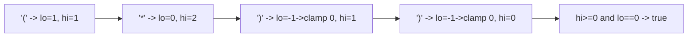

# 129. Valid Parenthesis String

## Problem

You are given a string containing only `(`, `)`, and `*` characters. The `*` character can be treated as either an opening parenthesis, a closing parenthesis, or an empty string. Determine whether the string can be interpreted as a valid parenthesis sequence.

## Example 1

### Input

```text
s = "(*))"
```

### Expected Output

```text
true
```

### Explanation

Treat the '*' as empty, leaving "())" minus the extra ')' — more precisely, treat '*' as '(' to get "(())", which is a valid sequence, so the original string is valid.

## Example 2

### Input

```text
s = "(*)"
```

### Expected Output

```text
true
```

### Explanation

Treat '*' as empty to get "()", a valid sequence.

## How to Solve

### Key Idea

Instead of trying every combination of what each `*` could mean, track a range of possible "open parenthesis counts": the minimum possible count and the maximum possible count as you scan left to right.

### Approach

1. Keep `lo` (minimum possible number of unmatched open parens) and `hi` (maximum possible number of unmatched open parens), both starting at 0.
2. For each character: if `(`, increment both `lo` and `hi`. If `)`, decrement both. If `*`, decrement `lo` (treat as closing) and increment `hi` (treat as opening).
3. If `hi` ever drops below 0, too many closing parens are forced — return false immediately.
4. Clamp `lo` to 0 whenever it goes negative (you can't have a negative count; that combination is just not chosen).
5. At the end, return whether `lo == 0` (there's some valid interpretation with zero unmatched opens).

### Why It Works

`lo` and `hi` track the full range of open-count possibilities achievable by choosing different meanings for the `*` seen so far. As long as the range stays valid (`hi >= 0`) and can reach zero by the end (`lo <= 0 <= hi`, achieved by clamping lo to 0), some assignment of `*` values makes the whole string balanced.

## Visual Explanation



## Optimal Solution

```python
class Solution:
    def checkValidString(self, s: str) -> bool:
        lo, hi = 0, 0

        for char in s:
            if char == '(':
                lo += 1
                hi += 1
            elif char == ')':
                lo -= 1
                hi -= 1
            else:  # '*'
                lo -= 1
                hi += 1

            if hi < 0:
                return False
            if lo < 0:
                lo = 0

        return lo == 0
```

## Complexity

- **Time:** O(n)
- **Space:** O(1)

## Real-World Uses

- Validating balanced brackets/tags in code or markup parsers where some tokens are ambiguous or optional.
- Checking well-formedness of expressions in configuration languages or templating engines with wildcard tokens.
- Verifying balanced markup in flexible document formats where certain delimiters can serve multiple roles.

## Key Takeaway

When a character has multiple possible interpretations, tracking a min/max range of outcomes instead of branching on every choice is a powerful greedy technique that keeps the solution linear.
